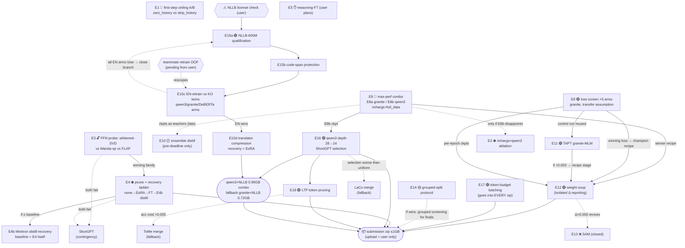

# Experiment Agenda — ocean box (4× RTX 3090)

Working doc for the autonomous test loop. Protocol: pick the highest-priority READY
item → create branch `exp/<id>-<slug>` → run → fill in **Result** here + write a
memory → commit (code + this file). One experiment = one branch + one commit trail.
Report summaries to the user; never wait on them mid-loop unless BLOCKED.

## Research branches

Five parallel lines. Each has a **git branch** `research/<name>`, a results doc at
`experiments/<name>/results.md`, and its figures in `experiments/<name>/figures/`.
Experiment work commits onto its research branch (short-lived `exp/<id>-<slug>`
branches off it are fine; merge back when the result lands).

| Branch | Doc | Experiments |
|--------|-----|-------------|
| `research/pruning` | [experiments/pruning/results.md](pruning/results.md) | E3, E4 |
| `research/serialization` | [experiments/serialization/results.md](serialization/results.md) | E2 |
| `research/first-step` | [experiments/first-step/results.md](first-step/results.md) | E1 |
| `research/reasoning` | [experiments/reasoning/results.md](reasoning/results.md) | E5 |
| `research/deferral` | [experiments/deferral/results.md](deferral/results.md) | E6 |
| `research/combine` | [experiments/combine/results.md](combine/results.md) | E8, E12 |
| `research/training` | [experiments/training/results.md](training/results.md) | E9, E10, E11, E13, E14 |
| `research/translation` | [experiments/translation/results.md](translation/results.md) | E15a-d |

## Dashboard

| ID | Branch | Test | Baseline | Result (uncal Δ) | Figures | Zip | Status |
|----|--------|------|----------|------------------|---------|-----|--------|
| E1 | first-step | Ceiling A/B (zero_history / strip_history) | hist0@slice 0.555 | task0 zero_hist **0.4283**, task1 strip_hist **0.4407** — both ≪ generalist 0.555 (specializing HURTS ~−0.11) | (harvesting) | — | ✅ DONE — first-step weakness **intrinsic**; don't build a specialist |
| E2 | serialization | richargs × Qwen3 (single-axis ablation) | qwen3 0.7682 | — | — | — | ⛔ gated on E8b — run ONLY if E8b disappoints (attribution) |
| E3 | pruning | FFN whitened-SVD probe (training-free) | champion rank-1.0 = 0.7734 (parity ✓) | ✅ FFN low-rank: **−0.26pt @ r=512** (66% params kept), **+0.4pt @ r=768** (denoises), cliff <r≈384 (−1.35pt @ 50% params) | [ffn_svd_degradation](pruning/figures/ffn_svd_degradation.png) | n/a (probe) | ✅ DONE — **E4 = GO** (FFN=44% params, the compression prize) |
| E4 | pruning | SVD prune + recovery FT | E8b 0.7643 (net) | ✅ **0.7688 — compression NET-POSITIVE**: FFN factored r=512 (~33% FFN / ~15% whole-model params cut) + recovery **BEATS uncompressed E8b by +0.0045**; SVD-LLM diff MATCH | [e4_recovery](pruning/figures/e4_recovery.png) | — | ✅ **DONE — E4 WIN** (ship-able compressed qwen3; recovery closes gap + low-rank FFN denoises). Next: r=384 for more compression |
| E5 | reasoning | Reasoning-FT → head A/B | qwen3 0.7682 | — | — | — | ✋ ON HOLD — user will plan further; do NOT dispatch |
| E6 | deferral | Two-model per-class-τ fallback robustness | qwen3 0.7682 | ❌ FAILS robustness: overall +0.0047 but held-out **au −0.0033**, **first-step −0.0016** (beats base on only 2/4 slices) | [e6_robustness](deferral/figures/e6_robustness.png) | n/a (dropped) | ❌ DROP — gain is sim/later-step majority artifact; 2× inference not justified |
| E7 | deferral | ~~Session-lookup deferral~~ | — | — | — | — | 🚫 DO NOT ATTEMPT — competition-rules risk (user decision 2026-07-07) |
| E8 | combine | **Max-performance combo** (backbone × richargs × full-data [× LS]) | **LB SOTA 0.77427** | 🏆 **E8a+LS granite 0.7803** (LS +0.0097 vs E8a 0.7706; **+0.0060 ABOVE SOTA on CV**) · E8b+LS qwen3 0.7659 (LS +0.0016, weak on qwen3) · E8a 0.7706 · E8b 0.7643 · CV≠LB | [e8a_vs_champion](combine/figures/e8a_vs_champion_slice.png) · [e8a_ls_transfer](combine/figures/e8a_ls_transfer.png) | ✅ **`submit_0707_granite_ls.zip` BUILT+VERIFIED** (val-F1 reproduced 0.7799, parity 5/5, no logit_bias, richargs; ⚠ pins transformers==4.51.3) — READY TO UPLOAD (user's call) · qwen3 zip after E8b+LS | ✅ **E8a+LS = best model of session** · TOP submission (upload-ready) · **TOP PRIORITY** |
| E9 | training | Macro-F1-targeted losses (focal / label-smoothing screen) | granite CE control 0.7458 | **LS ε=0.1 WINS +0.0107** (0.7565 vs CE 0.7458); focal γ=2 **−0.0055** (0.7403, hurts) | [e9_loss_screen](training/figures/e9_loss_screen.png) | — | ✅ DONE — **promote LS ε=0.1** (clears +0.003 bar 3.5×); close focal. Follow-up: confirm LS transfers to qwen3/E8 recipe (E8a+LS running GPU1; E8b+LS TBD) before final recipe |
| E10 | training | Ensemble→single distillation | best single at that time | — | — | — | 🕐 DEFERRED (user 2026-07-07): ensemble ceiling is correlated-error-bounded (E6 lesson) — attempt only in the final days before deadline if GPUs idle |
| E11 | training | TAPT continued pretraining (granite MLM on serialized texts) | E9 CE control 0.7458 (non-TAPT) | ✅ **0.7592 — TAPT HELPS +0.0134** vs non-TAPT 0.7458 (granite MLM-pretrained on 70k serialized texts → classify-FT) | [e11_tapt](training/figures/e11_tapt.png) | — | ✅ **DONE — E11 WIN** (domain MLM pretraining lifts granite; `src/mlm_tapt.py`, run_mlm ref; bs4 fixed attempt1 OOM) |
| E12 | combine | Weight averaging (multi-seed soup + intra-run SWA) — stacks onto E8 winner | best single seed of same recipe | ⚠️ 3 granite+LS seeds trained (42=0.7803, 43=0.7758, 44=0.7628 — **each on its OWN slice**, `--seed` conflates split+init) → soup DEPRIORITIZED (contaminated; clean same-split soup is the proper test) | — | — | 🟡 seeds done, soup deprioritized (caveated). **NB: STACK run (TAPT+richargs+LS)=0.772 also < E8a+LS 0.7803 → TAPT doesn't stack; nothing beat 0.7803 yet** |
| E13 | training | ~~SAM fine-tune~~ | — | — | — | — | ❌ CLOSED by analysis (user+evidence 2026-07-07): near-zero run variance (richmeta/richargs twins Δ=2e-5), error is intrinsic ambiguity, val≈LB; revive ONLY if E12 soup Δ>+0.005 |
| E14 | training | Session-grouped split protocol test (leak-free CV) | original qwen3: interleaved-val 0.7682 vs KNOWN LB 0.76698 | — | — | n/a (protocol) | 🟡 LOW priority — 1 grouped retrain of original qwen3 recipe; expectations LOW (uncal val-LB gaps already ≤0.008 and inconsistent) |
| E15a | translation | NLLB-600M qualification (GO/NO-GO) | 10-min inference budget | ❌ **NO-GO (throughput)**: NLLB-600M = **93 min for 30k** (~31 min even @3× speedup) ≫ 10-min budget (which must also fit the classifier) — translation-at-inference is budget-infeasible | — | n/a | ❌ CLOSED — throughput kills it; **closes E15b/c/d** (all gated). Translate-then-EN-classify not viable under budget |
| E15b | translation | Code-span protection (mask→translate→restore) | E15a preservation rate | — | — | n/a | ⛔ gated on E15a pick |
| E15c | translation | EN-data classifiers vs KO baselines (incl. DeBERTa-v3 / ModernBERT-large EN-only) | each backbone's KO twin (qwen3 0.7682 etc.) | — | — | — | ⛔ gated on E15a+b — THE payoff test; valid version of teammate's experiment |
| E15d | translation | Translator compression (vocab-prune/fp16) + 30k budget fit | E15a full-size translator quality/throughput | — | — | — | ⛔ gated on E15c success |
| E16 | pruning | qwen3 depth-prune 28→14 + recovery — **ShortGPT layer selection** (cosine redundancy) | E8b unpruned 0.7643 | ✅ **0.7638 — depth-prune ~FREE**: 14 layers (HALF depth → ~2× faster) + recovery = **−0.0005 vs full 28L** (kept `[0-7,9-11,19,21,27]`) | — | — | ✅ **DONE — E16 WIN** (~2× speed at ~same acc; stacks with E4 FFN-factor for a heavily-compressed qwen3) |
| E17 | combine | Inference engineering: token-budget batching (replaces fixed B=64) + length-sort everywhere | current script timing on 30k-scale load | — | — | n/a (goes into every zip) | 🟢 READY — pure local work, no GPU training; measure on 3090, OOM-safe by construction |
| E18 | pruning | **LTP token pruning** (drop unimportant tokens mid-network; ~2× throughput <1% drop on RoBERTa-class) | same model without token pruning (acc + ms/sample) | — | — | — | 🟢 READY (user-approved) — moderate engineering; ToMe merge = fallback if LTP fails |

Status legend: ⏸ blocked-external · ⛔ gated · 🔎 analysis · 🏃 running · ✅ done · ❌ refuted
New figures → `experiments/<branch>/figures/`; the `figures/` root holds pre-branch legacy plots.

## Experiment relationship graph



Solid arrows = gate/feed (downstream needs upstream). Dashed = contingency/fallback
(fires only on the labeled condition). 🚫E7 and ❌E6/E13 excluded from flow (closed).

**Sync state (2026-07-07, tick 1):** `src/`, `data/`, `analysis/cache/*_val_logits.npz` all present; HF reachable (base backbones download on demand). **Trained model weights were NOT synced as loose `output/` checkpoints — they live inside the `submissions/*.zip` archives** (unzip the relevant one to recover tensors; e.g. champion qwen3 = `submit_0703_qwen3_pruned.zip`, SOTA granite = `submit_names_single.zip`). Working tree is **mid-reorg** (`experiments/` itself untracked, `presentation/` deletions staged) → **subagents write results/figures but do NOT git-commit this tick**; supervisor handles git deliberately with the user.

## Loop control (stop conditions & cadence)

- **STOP the loop** (`ScheduleWakeup stop`) when: every Dashboard row is ✅ / ❌ / 🚫 /
  ⏸-blocked-external with nothing running — then post the batched final report. Also
  stop on 3 consecutive ticks with zero progress (same blockers, nothing running).
- **Success criteria are the per-experiment Read-outs** — deterministic numbers vs the
  named baseline, already specified per item. A result without its baseline Δ is not
  "done".
- **Cadence:** match ticks to how fast state changes — training runs need ~20-40 min
  wakeups (long sleeps), not minute-polling. Wake early only when a background task
  notification fires.
- **Budget guard:** if a tick discovers runaway token burn or a subagent looping on
  an error (>2 relaunches of the same failure), mark the item BLOCKED with the log
  tail and move on — never retry indefinitely.

## Orchestration (main session = supervisor, subagents = workers)

- **Experiments run in SUBAGENTS, not the main session** — one subagent per
  experiment (code edits, launch, monitoring its own run, harvesting, plotting,
  drafting the Result entry). Keeps the main context small across a long loop.
- The **main session only supervises**: dispatch the next READY item to a fresh
  subagent with a self-contained brief (experiment section + invariants verbatim);
  on each loop tick **verify and monitor**, don't re-do:
  1. **Liveness watchdog:** `nvidia-smi` + `ps` — every dispatched run must have its
     process alive AND GPU util > 0. Stalled (proc dead, log frozen, or util 0% for
     >10 min mid-training) → read the log tail, relaunch or mark BLOCKED in the
     Dashboard with the reason.
  2. **Correctness audit of finished work:** result CSV exists & parses; baseline
     Δ reported against the named baseline; uncalibrated; honest 2-fold where params
     were fitted; figure exists & linked; Dashboard row updated; branch committed.
     Spot-check numbers for plausibility (a "+5pt" claim gets its log read).
  3. Main session reads **tails and summaries only** — never full training logs.
- Continue a still-working subagent via SendMessage instead of spawning a duplicate;
  spawn fresh per new experiment.

## Invariants (apply to every experiment)

- **NO logit calibration.** Raw uncalibrated logits, argmax, `val_macro_f1` only.
- **On repeated failure: retry ~3–4 times (trying fixes each time), then MOVE ON — never stall or retry indefinitely.** If an experiment/step still fails after ~3–4 attempts, mark it **BLOCKED** in its Dashboard row AND its branch `results.md` with exactly WHERE/WHY it failed (the error, log tail, or missing dependency), then proceed to the next queue item. **Record every failure in the markdown for the user's later confirmation**; batch failures into reports — don't ask mid-loop. (A subagent looping on the *same identical* error counts as one attempt — don't let it spin.)
- **Python** = `/home/ocean/miniconda3/envs/dacon/bin/python` (conda env `dacon`).
- Eval protocol: `split_indices(seed=42)` — 56k train / 14k val. First-step slice =
  the 1,807 zero-history val samples. Any post-hoc rule with fitted params: honest
  2-fold (fit half, eval other half) — no exceptions.
- GPUs: check `nvidia-smi` before launching; one training run per 3090; keep ≥1 GPU
  free if the user is active. Long runs: `nohup ... > sbatch/logs/<tag>.out` on
  explicit `CUDA_VISIBLE_DEVICES`.
- **Every result gets a figure.** When a result lands, plot it (matplotlib PNG into
  `figures/`, repo dataviz style: BG #fcfcfb, blue #3987e5 / red #d4553f, recessive
  grid) — degradation curves, A/B bars vs baseline, confusion deltas, whatever fits
  the read-out — then link it in the Dashboard row AND the experiment's **Result**.
- **Marginal success ⇒ build the submission zip immediately** (don't wait to be
  asked): follow the [submission build recipe](../submission_richmeta/script.py)
  pipeline — prune_vocab (`--serialize` matched!) → serialize_variant.json → parity
  gate (`analysis/parity_pruned.py`, 0 mismatches) → smoke test → zip as
  `submit_<MMDD>_<tag>.zip`. **NO logit_bias.json in new zips** (no-calibration
  decision). Building the zip is pre-approved; UPLOADING it is not — flag it in the
  Dashboard Zip column and the user decides.
- **Paper-method implementations: get the official code first.** When implementing
  anything from a paper (FLAP, Wanda-sp, LTP, ShortGPT, SliceGPT, Minitron recovery,
  CometKiwi, LA loss, …), find and download the authors' GitHub repo and COMPARE our
  implementation against theirs before trusting results — papers routinely omit
  critical details (score normalization, eps/clamps, calibration-batch handling,
  where the bias fold happens, token-type quirks). Divergences from the paper's
  reported behavior get checked against the reference code, not re-derived from the
  paper text. If no official code exists, find the most-starred reproduction and note
  which one was used in the experiment's Result entry.
- **Eval-server environment (confirmed from rules page 2026-07-07): T4 GPU 16GB ·
  3 vCPU · 12GB RAM · offline · ≤1GB zip · ≤10min inference.** **NEVER project server timing from
  local hardware by a fixed factor — such projections have repeatedly been wrong
  (user experience). Budget predictions use MEASURED SERVER ANCHORS only:** qwen3
  9:06 · granite 5:10 · bge@1024 4:35 · bge-12L 2:29 · int8-qwen3 TIMEOUT (all actual
  eval-server times from past submissions). Predict a new variant only RELATIVE to
  its nearest anchor under a like-for-like change (e.g. depth-halved qwen3 ≈ ½ of
  9:06, same pipeline) and treat that as an estimate, not a guarantee. Anything with
  NO anchor (e.g. a translator stage) has UNKNOWN server time until a submission
  measures it — first submission of any new pipeline must be the most conservative
  (fastest) variant to bank an anchor before risking richer ones. Local 3090 timings
  (E17) are for RELATIVE comparisons between our own variants only. 3 vCPU means
  tokenization/preprocessing is CPU-bound at inference — batch the tokenizer, avoid
  per-sample Python loops. 12GB RAM caps how much we can hold in memory at once.
  License rule: external models need only LICENSE COMPLIANCE, not commercial-use
  rights ("법적 제한이 없는 사전 학습 모델… 확인하고 준수"); NLLB CC-BY-NC = gray zone
  → organizer Q&A question posted by user; m2m100 (MIT) = clean fallback.
- **Every test names its baseline** and reports Δ against it — never a bare number.
  The **project champion baseline is Qwen3-0.6B full-FT v1@512 = 0.7682 uncal**
  (`output/pat/ft_Qwen__Qwen3-Embedding-0.6B/checkpoint-10500`, val logits cached at
  `analysis/cache/qwen3_val_logits.npz`). The baseline for a specific test must be
  **matched on everything except the manipulated variable** (same backbone, recipe,
  eval slice) — champion + slice restriction when no closer control exists.
  Reference uncal numbers: qwen3 0.7682 · bge richmeta 0.7615 · hist0 0.7504 ·
  granite-311m 0.7153. First-step slice: hist0 0.555 / qwen3 0.573.
- Big local facts: labels weakly semantic (reasoning caps ~0.28); explore-group
  ceiling ~0.60 (LoRA = full-FT = restricted generalist); first-step is the
  concentrated weak zone; margin AUROC→correctness ≈ 0.83–0.85 but can only defer,
  not fix (best post-hoc: two-model per-class-τ fallback 0.7732).

## Queue (priority order)

### E8 · Max-performance combination — TOP PRIORITY — 2 GPUs, ~2-5h/arm
**Hypothesis:** the LB-proven gains are separable axes nobody has stacked: backbone
(qwen3 +0.025 over bge), serialization dir-removal (richargs +0.021 on bge; SOTA's
"names" only basenames the META open-files — history-arg stripping is untested on
it), and all-data training (+0.014; SOTA's core trick). Stacking beats SOTA 0.77427.
**Test (details: [experiments/combine/results.md](combine/results.md)):**
- E8a: granite-311m (ModernBERT 22L) + richargs + `--full_data` — SOTA replication + our axis.
- E8b: qwen3-0.6B + richargs + `--full_data` @512 — best backbone + everything.
- Both: tokenizer-prune, NO logit bias. Optional E8c: +depth-prune for budget.
**Baseline:** LB SOTA **0.77427**; CV-side, champion qwen3 restricted to the same
25%-val eval slice (recompute from cached logits — `--full_data` evals on 3.5k).
**Read-out:** either arm's zip > SOTA on LB when the user submits. Budget guard:
qwen3 arm must stay under ~9 min projected (int8 timeout lesson).
**Status:** pending sync (`src/`, granite dl or HF cache). **Result:** —

### E9 · Macro-F1-targeted losses — 🟢 READY (screen when a GPU frees) — 1 GPU, ~2h/arm
**Source:** papers/training/FocalLoss_ICCV2017, LabelSmoothing_NeurIPS2019.
**Hypothesis:** metric is macro-F1 but we train plain CE on imbalanced classes
(edit_file 15.8% vs web_search 1.8%); focal loss (γ≈2) or label smoothing (ε≈0.1)
lifts rare-class F1 without the aux-objective failure mode (they REPLACE the loss,
not add a competing objective — supcon/rdrop lesson doesn't apply).
**Test:** screen on granite-311m (fast, ~2h/arm): plain-CE control vs focal (γ=2) vs
LS (ε=0.1) vs class-weighted CE (inverse-frequency — the most literal macro-F1
surrogate: macro-F1 weights all classes equally, so does weighted CE). Identical
recipe otherwise (v1@512, standard split). Winner (if Δ>+0.003) reruns on the
champion recipe. Needs a small `--loss focal|ls|wce|la` hook in finetune.py.
Note: macro-F1 itself is non-differentiable (piecewise-constant counts) — these are
differentiable CE surrogates that shift the optimum toward rare-class recall.
**5th arm — logit-adjusted loss** (Menon et al. 2021, arXiv:2007.07314): train with
`logits + log(class_prior)` inside the CE — the theoretically consistent surrogate
for balanced-error/macro metrics. ⚠️ NOT the banned calibration: the ban covers
post-hoc bias FIT ON VAL at inference; LA uses fixed train-set log-priors during
TRAINING only, inference stays raw argmax. Flagged for user veto if uncomfortable.
**Baseline:** the plain-CE granite control arm — same backbone/recipe, only loss differs.
**Read-out:** any arm > control +0.003 → promote to champion recipe; else ❌ close the axis.
**Status:** ready, queued behind running jobs. **Result:** —

### E10 · Ensemble→single distillation — 🕐 DEFERRED to pre-deadline (user decision 2026-07-07)
**Deferral rationale:** E6 showed both models fail on the SAME low-margin samples
(correlated errors), bounding what a student can inherit from an ensemble teacher —
so this is a late-stage flyer, not a priority lane. Attempt only in the final days
if GPUs are idle and the champion has plateaued.
**Source:** papers/models/DistilBERT, training/MiniLM lineage + LOCAL evidence:
teammate's granite distillation CV 0.754 vs 0.7461 plain FT (+0.008); two-model
oracle = 0.810 but E6 proved post-hoc routing can't reach it and 2× inference is out.
**Hypothesis:** distilling a multi-teacher ensemble (E8b qwen3 + E8a granite [+ bge
hist0 if synced]) into ONE student captures part of the 4-pt oracle gap at 1×
inference cost — the only legitimate route to ensemble gains under the budget.
**Test:** average teachers' train-set logits (each evaluated on the train split) →
`--distill_from` (plumbing already in finetune.py); student = the E8-winning
backbone, same recipe; sweep α∈{0.5,0.9} if time allows.
**Baseline:** the best single model at dispatch time (E8 winner, else champion 0.7682)
on the matching eval slice.
**Read-out:** student > best-single +0.004 → new champion + zip; else ❌.
**Status:** 🕐 DEFERRED — do NOT dispatch; user re-activates near deadline only. **Result:** —

### E11 · TAPT continued pretraining — 🟢 READY (user-approved 2026-07-07) — 1 GPU, ~3-4h total
**Source:** papers/training/TODBERT, IntentBERT (Gururangan-style task-adaptive pretraining).
**Hypothesis:** our serialization is a dialect far from pretraining text ([META] k=v
headers, ACTION lines, JSON args, KR/EN mix); adapting the backbone to its statistics
first frees the classification FT to spend capacity on the label mapping. Papers: ~+0.5-1pt.
**Test:** granite-311m + MLM (DataCollatorForLanguageModeling, mlm_probability 0.15-0.3)
on the 70k **richargs-serialized** texts (must match downstream format), 1-2 epochs,
LR ~1e-5 → then the standard classification FT from the adapted weights.
New small script (e.g. src/tapt.py) + `--init_from` the TAPT output.
Note: embedding-adapted checkpoints may ship without the MLM head — HF re-inits it
(weight-tied, converges fast); early-step loss noise is EXPECTED, don't kill the run on it.
**Baseline:** same-recipe classification FT WITHOUT the TAPT phase (identical
backbone/serialize/split/seed) — if E9's granite control exists by then, reuse it.
**Read-out:** TAPT-arm > control +0.003 → adopt as recipe stage (and consider qwen3-CLM
variant); else ❌ close.
**Priority:** below E9 (dispatch on a free GPU after E9 arms are placed).
**Status:** READY. **Result:** —

### E12 · Weight averaging: model soup + SWA — 🟢 READY — branch: **combine** — ~0-2h extra
**Why combine, not training:** no task hypothesis — it's a pure performance-stacking
device (user call, 2026-07-07). Its terminal purpose is to be the LAST stage applied
to the E8-winning recipe before zipping: `E8 winner (+ any E9/E11 upgrades) × 3 seeds
→ soup → parity gate → zip`. Results/figures live in experiments/combine/.
**Source:** Model Soups (Wortsman, ICML 2022), SWA (Izmailov 2018), WASAM (NeurIPS 2022).
**Hypothesis:** averaging weights of same-recipe runs (different seeds) or of late
checkpoints within a run lands nearer the flat-minimum centroid → typical free
+0.3-1pt on classification, ZERO inference cost, no architecture change.
**Test (two tiers):**
- E12a intra-run: for E9/E11 granite runs, set `save_total_limit`≥3 & save per epoch;
  average last-k checkpoints (k=2,3), eval uncal vs the best single checkpoint.
- E12b multi-seed soup: 3 seeds of the E9-winning granite recipe (~2h each, can
  reuse the E9 winner as seed 1); UNIFORM soup + GREEDY soup (add a seed only if
  held-out improves — greedy needs the honest-fold discipline). If Δ>+0.003 →
  replicate on the champion/E8 recipe and zip.
**Baseline:** the best single-seed model of the identical recipe.
**MANDATORY isolation reporting (user requirement):** every soup application reports
the full decomposition — each seed's score · best single seed · uniform-soup ·
greedy-soup · Δ(soup − best single) — in the Results entry, the Dashboard row, AND
its own figure (per-seed bars + soup bars). When the souped model feeds a submission
zip, the zip's Dashboard entry must state the soup Δ separately so its contribution
is never blended into the stacked number.
**Constraint:** soup requires SAME init/recipe/tokenizer — never soup across
backbones or serializations.
**Status:** READY (E12a costs nothing beyond disk; coordinate `keep_checkpoints`).
**Result:** —

### E13 · ~~SAM fine-tuning~~ — ❌ CLOSED BY ANALYSIS (2026-07-07)
**Why closed (user argument + local evidence):** SAM buys generalization via flat
minima, but (1) run-to-run variance here is ~zero — richmeta/richargs, two fully
independent full-FT runs, landed Δ=0.00002 apart: no landscape variance to harvest;
(2) residual error is intrinsic label ambiguity (capacity/specialist/ceiling probes
all saturate) — flatness cannot reduce Bayes error; (3) val≈LB shows no distribution
penalty, and SAM's documented LM gains concentrate in low-data regimes (we have 70k).
**Revival condition (the only one):** E12 soup Δ > +0.005 — that would be direct
evidence of harvestable landscape roughness, contradicting (1). Otherwise stay closed.
**Result:** closed without run.

### E14 · Session-grouped split protocol test — 🟡 LOW PRIORITY — 1 GPU, ~4-5h
**Motivation:** steps of one session straddle our train/val (histories nest → mild
leak; ~99% of val shares a session with train). Teammate's session-grouped CV
(StratifiedGroupKFold by session) matched LB within +0.002. HOWEVER (user point +
corrected analysis): in UNCALIBRATED terms our val-LB gaps are already small and
inconsistent (qwen3 −0.0012, richargs +0.001, bge-full −0.008) — most of the old
apparent optimism was the banned calibration inflating CV. Expectations LOW; value
= selection fidelity for endgame candidates, not points.
**Test:** retrain the ORIGINAL champion recipe (qwen3 v1@512, plain 80/20) with a
session-grouped split (SGKF(5) fold0, groups=session id, seed 42; needs a
`--group_split` option in split_indices). No full_data, no richargs — keep identical
to the recipe whose LB is KNOWN.
**Baseline (why original qwen3, not E8):** the read-out needs a known LB. Original
qwen3 LB = 0.76698 is on the board; E8's LB doesn't exist yet, and full_data has no
clean grouped analog. Compare: interleaved-val 0.7682 vs grouped-val (new) vs LB.
**Read-out:** |grouped−LB| ≪ |interleaved−LB| → adopt grouped screening for all
final candidates (incl. E8 winners, one grouped retrain each). Both within noise →
❌ close, keep current protocol (user's prediction).
**Status:** ready, LOW priority (after E9/E11/E12 placements). **Result:** —

### E1 · First-step ceiling A/B — READY (needs src/ synced) — 2 GPUs, ~4h
**Hypothesis:** first-step (zero-history) error is intrinsic, not dilution — a
dedicated model won't beat the generalist's 0.555 first-step macro-F1. Rider: if
strip-history augmentation (10× data, labels chosen given history) ≥ clean subset,
history is redundant for the mapping; if <, labels are history-dependent.
**Test:** full-FT bge-m3 AdamW, both eval on the same 1,807 first-step val:
task 0 `--zero_history` (7,193 real first-steps) vs task 1 `--strip_history`
(all 56k, history stripped; `turn=` kept deliberately).
```
CUDA_VISIBLE_DEVICES=0 nohup <PY> -u -m src.finetune --model BAAI/bge-m3 --serialize v1 \
  --zero_history --tag ceil_firststep --max_len 1024 --epochs 3 --lr 2e-5 --optim adamw_torch \
  --batch_size 4 --grad_accum 4 --out_dir ./output/pat --results_name ft_results_firststep_0.csv \
  > sbatch/logs/local-ceil-firststep.out 2>&1 &
CUDA_VISIBLE_DEVICES=1 ... --strip_history --tag ceil_striphist ... ft_results_firststep_1.csv
```
**Baseline:** hist0 generalist restricted to the same 1,807 first-step val slice =
**0.555 macro-F1** (same backbone bge-m3, same recipe — only the training data
changes). Secondary reference: qwen3 on the slice, 0.573. Task 1's baseline is task 0.
**Read-out:** specialist ≈0.55 → intrinsic, stop chasing first-step; ≥0.60 → build
first-step specialist / has-history signal into the submission model.
**Status:** pending sync. **Result:** —

### E2 · richargs × Qwen3 single-axis ablation — ⛔ GATED ON E8b (diagnostic only)
**Why gated:** E8b ⊇ E2 — both train qwen3 with dir-shortened serialization; E8b adds
`--full_data`. Running E2 upfront is redundant. E2 exists to ATTRIBUTE an E8b
disappointment: if E8b ≤ ~champion, run E2 (qwen3 + richargs, standard split, no
full_data) to isolate which axis failed to transfer to qwen3.
**Trigger:** E8b eval-slice score < champion-on-same-slice + 0.005.
**Test if triggered:** champion recipe @512, only `--serialize richargs` changed.
**Baseline:** champion qwen3 v1@512 = **0.7682** (identical recipe, full-val comparable).
**Status:** gated. **Result:** —

### E3 · FFN whitened-SVD probe (training-free) — READY (needs qwen3 ckpt synced) — 1 GPU, ~30m
**Hypothesis:** FFN (44% of params — the real compression prize; naive width-slice
failed) is as low-rank as K/V were (95.5% energy @ 25% rank, −0.5pt @ 50% rank).
**Test (3-scorer FFN probe, user-approved 2026-07-07):** extend `analysis/palu_probe.py`
to gate/up/down with THREE methods at equal parameter budgets (50/37.5/25%), all off
one calibration pass: (a) whitened-SVD low-rank; (b) **Wanda-sp** neuron slice
(|W|·‖X‖ scoring — official repo required per invariant); (c) **FLAP** neuron slice
(fluctuation scoring + bias-fold compensation — repo: CASIA-IVA-Lab/FLAP). CFSP
dropped (user: too complicated; revisit only if per-layer budget allocation becomes
the bottleneck). Winner's family goes to E4.
**Baseline:** the UNMODIFIED champion ckpt on the identical 3k-val subset, evaluated
in the same script run (the rank-1.0 row — was 0.7734 on this subset for the KV probe;
re-print it, never compare against full-val numbers across subsets).
**Read-out:** if −1pt @ ≤50% rank → E4 is GO with FFN as target; if it craters,
SVD track shrinks to attention-only (minor) and E4 deprioritizes.
**Status:** pending sync. **Result:** —

### E4 · SVD prune + recovery fine-tune — GATED ON E3 — 1-2 GPUs, ~6h/rank
**Hypothesis:** prune-then-recover (our regime, unlike Palu's training-free) closes
the truncation gap; net ≈0 loss at real compression (target: FFN 50% + KV r=384,
possibly × depth-prune × vocab-prune ⇒ granite-size model at qwen3 accuracy).
**Test:** materialize factored `down·up` Linear pairs (init = whitened SVD),
`--init_from` qwen3 ckpt, recover 1-2 ep @ low LR; eval uncal. Needs a
`from_pretrained` story (custom module or load-hook) before it can ever ship.
**Baselines (two):** (a) champion qwen3 = **0.7682** full-val — the net-loss check;
(b) the SAME pruned model training-free from E3's curve — isolates what recovery
fine-tuning itself buys at that rank.
**Recovery ladder (user-approved): none → EoRA (training-free closed-form low-rank
compensation, minutes/point — measure on every sweep point; if within ~0.002 of full
recovery, skip the FT) → recovery-FT → E4b distill. EoRA ships as a parallel low-rank
branch (needs load-hook; small extra params).**
**E4b · Minitron-style distill-recovery (user-approved follow-up, gated on E4 ≥
baseline):** rerun E4's best configuration but replace plain recovery-FT with
distillation from the UNPRUNED parent (`--distill_from` its train-logits; NOT the
deferred E10 — teacher is the model's own parent, single-model). **Baseline for E4b =
the original E4 result** (same pruned architecture, plain recovery). Report Δ(distill −
plain recovery) explicitly.
**Contingency (user 2026-07-07):** if E3/E4 both fail → try SliceGPT (PCA-rotate then
slice hidden dim — the principled width prune) as the alternative width axis.
**Status:** blocked by E3. **Result:** —

### E5 · Reasoning-FT → head A/B — ✋ ON HOLD (user decision 2026-07-07)
**Do NOT dispatch.** The user wants further analysis and planning before this runs
(aux-objective design, rationale source, and whether it competes with E8 for GPUs).
Hypothesis/test below are kept for when it is re-activated.
**Hypothesis (skeptical):** training the backbone to also generate the label token
(rationale-style aux) does NOT beat plain head-FT — labels are weakly semantic, and
every aux objective so far (supcon −0.7pt, rdrop) hurt. Budget-side is fine (head-only
inference), so this is purely a quality question.
**Test:** qwen3-0.6B, plain full-FT vs +generate-label aux (new small aux hook in
finetune.py, pattern after rdrop/supcon), same recipe otherwise, uncal val.
**Baseline:** champion qwen3 v1@512 = **0.7682** (already trained with the identical
plain recipe — reuse it as the control arm; only rerun a fresh control if the aux
arm's recipe must deviate, e.g. different max_len, so arms stay matched).
**Status:** ✋ ON HOLD — awaiting user planning; not dispatchable. **Result:** —

### E6 · Two-model per-class-τ fallback — DECISION ITEM (analysis done)
Held-out 0.7732 (+0.005 over qwen3) but needs both models at inference (~2× cost,
easily within 10-min budget) and 14 fitted τ. Before shipping: check robustness by
generator (fit on sim-only → eval au) and by step. If it survives, candidate for
submission composition. **Baseline:** single-model champion qwen3 = **0.7682** (the
fallback must beat it after the honest 2-fold, on every robustness slice, to justify
2× inference). **Status:** analysis cached (`analysis/gap_fix.py`,
`analysis/cache/*_val_logits.npz`). **Result (robustness):** —

### E7 · ~~Session-lookup deferral machinery~~ — 🚫 DO NOT ATTEMPT
**Removed by user decision (2026-07-07): exploiting (session,step)→action lookup from
train histories may violate competition rules.** Do not build, test, or include any
form of session-lookup in analyses or submissions. Entry kept only so the idea isn't
re-proposed. (The underlying observation — train histories contain later steps of the
same sessions — remains recorded in memory as a data property, flagged do-not-use.)

### E15 · Translation pipeline series — design lives in [experiments/translation/results.md](translation/results.md)
**E15a bake-off** 🟢 READY (~1 GPU-h, offline): 6 candidates (opus-mt floor, NLLB-600M/1.3B
⚠CC-BY-NC rules check, madlad-3b, m2m100-418M, EXAONE-2.4B Korean-specialist) scored on
CometKiwi QE + code-token preservation + throughput→30k-budget projection + 30-sample
human sheet for user review. **E15b** protection pipeline (mask code spans → translate →
restore), gated on the pick. **E15c THE payoff test** (gated on a+b): translate all train
consistently, retrain qwen3/granite on EN + English-only DeBERTa-v3-large / ModernBERT-
large, each vs its KO twin — the valid version of the teammate's invalid experiment;
prediction on record: skeptical (weak-semantic labels), but honestly testable now.
**E15d** translator compression (vocab-prune 256k emb + fp16 + depth) + end-to-end 30k
timing, only if E15c passes. Baselines: per-arm KO twins; budget guard ≤ ~2-3 min
translation share.

### E16 · qwen3 depth-prune + recovery — 🟢 READY once E8b checkpoint exists
28L→14L on the E8b winner → recovery FT (1-2ep low LR) → uncal val vs unpruned twin.
**Layer SELECTION = ShortGPT-style (user-approved):** rank layers by cosine(input,
output) redundancy on ~1k calibration samples; drop the 14 least-transforming (vs our
old evenly-spaced heuristic). Report the selection map. **Fallback if ShortGPT
selection underperforms evenly-spaced: LaCo-style merge** (average the dropped layer
into its neighbor) before giving up on the extra depth.
bge precedent: −40% size, 1.85× faster, **+0.01 LB**. Payoff: fixes the 9:06 budget,
feeds the 본선 speed score (10%), enables the qwen3+NLLB 1GB combo, smaller zip.
Read-out: Δ ≥ −0.002 vs unpruned → adopt for deployment; also report inference time.

### E17 · Inference engineering: dynamic token-budget batching — 🟢 READY (no training)
Replace fixed BATCH_SIZE=64 with token-budget batches (cap ≈ 64×512 tokens; keeps the
worst-case memory of today's config → OOM-safe on unknown eval GPU) + keep length-sort;
apply to OUR script template AND the granite/SOTA-style script (which currently doesn't
even length-sort). Measure: ms/sample + total projected 30k time on a 3090 synthetic
load, before/after, per model (granite/qwen3/12L variants). Lands in every future zip;
also widens the time margin the translation route needs.

### E18 · LTP token pruning — 🟢 READY (user-approved 2026-07-07) — 1 GPU, ~4h
**Source:** Learned Token Pruning (Kim et al.) / PoWER-BERT lineage.
**Mechanism:** learn per-layer attention-score thresholds; tokens below threshold are
DROPPED as the sequence flows through — classification needs only the pooled vector,
so most tokens can vanish mid-network. Attacks SEQUENCE LENGTH (orthogonal to weight
pruning; compounds with E16 depth-prune and E17 batching). Literature: ~2× throughput
at <1% accuracy on RoBERTa-class encoders.
**Test:** apply to the best deployment candidate (granite or qwen3 per E8); train with
pruning enabled, threshold sweep for the accuracy/speed knee; report uncal val AND
ms/sample vs the same model without token pruning.
**Shipping caveat:** custom forward must survive from_pretrained in the zip (same
class of work as E4's factored modules — plan the load-hook up front).
**Fallback (user):** if LTP's accuracy cost >0.005 or engineering stalls → ToMe-style
token MERGING (training-free variants) before abandoning the token axis.
**Status:** ready, queue behind E16. **Result:** —

### Backlog / housekeeping
- rdrop (disc task 0) never finished on the old box — superseded in spirit by supcon's
  regression; rerun on a spare GPU only if idle capacity exists.
- FFN+attn combined probe (E3 extension: all four attn projections too, Q/O = 2× KV).
- au-generator robustness view for whichever model ships (au = 7% of train; test mix unknown).

## Results log
(append: date · experiment · branch · key numbers · memory file)
- 2026-07-07 · **E6** · research/deferral · two-model per-class-τ fallback **FAILS robustness** → DROP. Overall honest 2-fold +0.0047 (qwen3 0.7682→0.7729) but per-slice net-NEGATIVE on the two stress tests: held-out `au` generator −0.0033, zero-history first-step −0.0016; beats base on only 2/4 slices (sim +0.0024, later +0.0020). Gain is a sim-heavy/later-step majority artifact; 2× inference cost unjustified. Script `analysis/gap_robustness.py`, figure `experiments/deferral/figures/e6_robustness.png`. Memory: [[two-model-fallback-fails-robustness]]. (not git-committed — mid-reorg tree)
