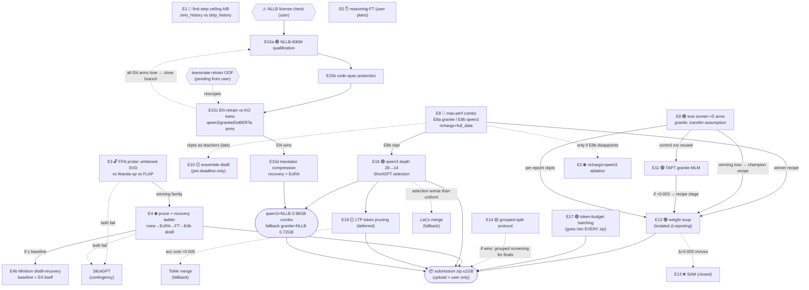

# Experiment Agenda — ocean box (4× RTX 3090)

Working doc for the autonomous test loop. Protocol: pick the highest-priority READY
item → run → fill in **Result** here + write a memory. **Do NOT create git branches
and do NOT commit** — a single shared working tree with training in flight makes
branching/committing disruptive and risks tangling concurrent edits; leave all changes
uncommitted for the user to handle. Report summaries to the user; never wait on them
mid-loop unless BLOCKED.

## Research groups

Five parallel lines. Each is a **logical grouping only** — a results doc at
`experiments/<name>/results.md` and its figures in `experiments/<name>/figures/`.
**These are NOT git branches: do not create branches, do not commit** (single shared
working tree + live training). The table maps each group to its doc and experiments.

| Group | Doc | Experiments |
|--------|-----|-------------|
| `research/pruning` | [experiments/pruning/results.md](pruning/results.md) | E3, E4 |
| `research/serialization` | [experiments/serialization/results.md](serialization/results.md) | E2 |
| `research/first-step` | [experiments/first-step/results.md](first-step/results.md) | E1 |
| `research/reasoning` | [experiments/reasoning/results.md](reasoning/results.md) | E5 |
| `research/deferral` | [experiments/deferral/results.md](deferral/results.md) | E6 |
| `research/combine` | [experiments/combine/results.md](combine/results.md) | E8, E12 |
| `research/training` | [experiments/training/results.md](training/results.md) | E9, E10, E11, E13, E14 |
| `research/translation` | [experiments/translation/results.md](translation/results.md) | E15a-d |
| `research/misclf-detection` | [experiments/misclf-detection/results.md](misclf-detection/results.md) | E20 (M0–M5), E23 (TTA harness `tta_eval.py`) |
| `research/coreset` | [experiments/coreset/results.md](coreset/results.md) | E22 (C1–C7, drop-noisy) |
| `research/tta` | (SUBMISSIONS.md rows 11–13) | E23 (test-time adaptation) |
| `research/token-selection` | [experiments/token-selection/results.md](token-selection/results.md) | E24 (A/B/C/D select+refit) |
| `research/miseo-recipe` | [experiments/miseo-recipe/results.md](miseo-recipe/results.md) | E25 (a recipe repro / b +LS+bf16 / c richmeta) |
| `research/ensemble` | [experiments/ensemble/results.md](ensemble/results.md) | E26 (checkpoint ensemble under submission constraints) |

## Dashboard

| ID | Branch | Test | Baseline | Result (uncal Δ) | Figures | Zip | Status |
|----|--------|------|----------|------------------|---------|-----|--------|
| E1 | first-step | Ceiling A/B (zero_history / strip_history) | hist0@slice 0.555 | task0 zero_hist **0.4283**, task1 strip_hist **0.4407** — both ≪ generalist 0.555 (specializing HURTS ~−0.11) | [firststep_ceiling_ab](first-step/figures/firststep_ceiling_ab.png) | — | ✅ DONE — first-step weakness **intrinsic**; don't build a specialist |
| E2 | serialization | richargs × Qwen3 (single-axis ablation) | qwen3 0.7682 | — | — | — | ⛔ gated on E8b — run ONLY if E8b disappoints (attribution) |
| E3 | pruning | FFN whitened-SVD probe (training-free) | champion rank-1.0 = 0.7734 (parity ✓) | ✅ FFN low-rank: **−0.26pt @ r=512** (66% params kept), **+0.4pt @ r=768** (denoises), cliff <r≈384 (−1.35pt @ 50% params) | [ffn_svd_degradation](pruning/figures/ffn_svd_degradation.png) | n/a (probe) | ✅ DONE — **E4 = GO** (FFN=44% params, the compression prize) |
| E4 | pruning | SVD prune + recovery FT | E8b 0.7643 (net) | ✅ **0.7688 — compression NET-POSITIVE**: FFN factored r=512 (~33% FFN / ~15% whole-model params cut) + recovery **BEATS uncompressed E8b by +0.0045**; whitening matches official `AIoT-MLSys-Lab/SVD-LLM@7538cca` (truncate(W·L)·L⁻¹) — ⚠️ clone+unit-test live only in an ephemeral /tmp scratchpad, not committed in-repo | [e4_recovery](pruning/figures/e4_recovery.png) | — | ✅ **DONE — E4 WIN** (ship-able compressed qwen3; recovery closes gap + low-rank FFN denoises). Next: r=384 for more compression |
| E5 | reasoning | Reasoning-FT → head A/B | qwen3 0.7682 | — | — | — | ✋ ON HOLD — user will plan further; do NOT dispatch |
| E6 | deferral | Two-model per-class-τ fallback robustness | qwen3 0.7682 | ❌ FAILS robustness: overall +0.0047 but held-out **au −0.0033**, **first-step −0.0016** (beats base on only 2/4 slices) | [e6_robustness](deferral/figures/e6_robustness.png) | n/a (dropped) | ❌ DROP — gain is sim/later-step majority artifact; 2× inference not justified |
| E7 | deferral | ~~Session-lookup deferral~~ | — | — | — | — | 🚫 DO NOT ATTEMPT — competition-rules risk (user decision 2026-07-07) |
| E8 | combine | **Max-performance combo** (backbone × richargs × full-data [× LS]) | prior LB SOTA 0.77427 | 🏆 **LB (submitted 07-08): qwen3_ls (E8b+LS) 0.77921 🥇 · granite_ls (E8a+LS) 0.77738 🥈 — both beat 0.77427.** full_data CV: E8a+LS 0.7803 · E8b+LS 0.7659 · E8a 0.7706 · E8b 0.7643. ⚠️ **CV→LB reversal** — granite led CV, qwen3 won LB; trust LB | [e8a_vs_champion](combine/figures/e8a_vs_champion_slice.png) · [e8a_ls_transfer](combine/figures/e8a_ls_transfer.png) | ✅ **SUBMITTED** — `submit_0707_qwen3_ls.zip` (LB 0.77921, 9:18, fp16) · `submit_0707_granite_ls.zip` (LB 0.77738, 5:06, fp32 846M; fp16 twin 539M available) — both no logit_bias, pin transformers==4.51.3 | ✅ **DONE — qwen3_ls = new SOTA.** granite = fast #2. See SUBMISSIONS.md rows 9–10 |
| E9 | training | Macro-F1-targeted losses (CE / focal / LS / wce / logit-adjusted) | granite CE control 0.7458 | **LS ε=0.1 WINS +0.0107** (0.7565); **wce +0.0083** (0.7541, real #2); **la τ=1 −0.0002** (0.7456, flat); focal **−0.0055** (0.7403) | [e9_loss_screen](training/figures/e9_loss_screen.png) | — | ✅ **DONE — all 5 arms.** promote LS; wce also clears the +0.003 bar but < LS; la (τ=1) & focal closed. Principled macro losses split (wce helps, la null); LS wins despite not being macro-designed |
| E10 | training | Ensemble→single distillation | best single at that time | — | — | — | 🕐 DEFERRED (user 2026-07-07): ensemble ceiling is correlated-error-bounded (E6 lesson) — attempt only in the final days before deadline if GPUs idle |
| E11 | training | TAPT continued pretraining (granite MLM on serialized texts) | E9 CE control 0.7458 (non-TAPT) | ✅ **0.7592 — TAPT HELPS +0.0134** vs non-TAPT 0.7458 (granite MLM-pretrained on **56k train-slice** serialized texts, **v1**, val held out — no leak → classify-FT) | [e11_tapt](training/figures/e11_tapt.png) | — | ✅ **DONE — E11 WIN** (domain MLM pretraining lifts granite; `src/mlm_tapt.py`, run_mlm ref; bs4 fixed attempt1 OOM) |
| E11b | training | **TAPT-stack corrected** — TAPT on **richargs** (matches classify) → E8a+LS recipe verbatim, only encoder init differs | E8a+LS **0.7803** (full_data); old v1-TAPT stack 0.772 | ❌ **0.7769 — TAPT does NOT stack (−0.0034)**: richargs-matched TAPT → E8a+LS lands BELOW plain E8a+LS 0.7803. Fixing the v1→richargs mismatch helped (0.772→0.7769) but still short → the standalone E11 TAPT win (+0.0134 over bare CE) is redundant with LS+full_data | — | — | ❌ **DONE — TAPT redundant with the full recipe.** The E11 gain overlaps what LS+full_data already buy; adding a TAPT init stage is net-negative here. Champion recipe (E8a+LS, no TAPT) stands. Out `..._estack_v2_tapt_richargs_ls`; log `sbatch/logs/estack_v2.out` |
| E12 | combine | Weight averaging (multi-seed soup + intra-run SWA) — stacks onto E8 winner | best single member of same recipe (granite E8a+LS 0.7803 · qwen3 E8b+LS 0.7659) | ⚠️ **v1 CRATERED −0.056**: uniform soup of 3 granite members (0.77989/0.76874/0.77917) = **0.72416**. Members had **different inits** (`--init_seed 2/3/42` → different head init) → NOT linearly mode-connected → averaging destructive. Design flaw, not a soup_average bug (member evals all correct). qwen3 members KILLED before wasting ~3h on the same crater | ⚠️ pending (v2) | — | ⏸ **DEFERRED — fix then rerun (user 2026-07-08):** soup members must SHARE init and diversify via a connectivity-preserving lever (LR), not via init. v2 = all members `--seed 42 --init_seed 42` + LR∈{1e-5,2e-5,3e-5}. Run only after the active queue clears (user: others first). See Deferred §E12 |
| E13 | training | ~~SAM fine-tune~~ | — | — | — | — | ❌ CLOSED by analysis (user+evidence 2026-07-07): near-zero run variance (richmeta/richargs twins Δ=2e-5), error is intrinsic ambiguity, val≈LB; revive ONLY if E12 soup Δ>+0.005 |
| E14 | training | Session-grouped split protocol test (leak-free CV) | original qwen3: interleaved-val 0.7682 vs KNOWN LB 0.76698 | — | — | n/a (protocol) | 🟡 LOW priority — 1 grouped retrain of original qwen3 recipe; expectations LOW (uncal val-LB gaps already ≤0.008 and inconsistent) |
| E15a | translation | NLLB-600M qualification (GO/NO-GO) | 10-min inference budget | ❌ **NO-GO for inference-time translation (throughput)**: NLLB-600M measured **93 min for 30k on a LOCAL 3090** (23.23 sent/s, batch16/greedy/fp16 = fastest config). T4 ≥ this (3090 is faster), so ≫ the 10-min budget regardless — anchor-safe. ("~31 min @3× speedup" = a hypothetical optimization cushion, NOT a server projection.) | — | n/a | ❌ CLOSED for **inference-time** translation (E15b, E15d). ⚠️ Does **NOT** close **E15c** — that trains on OFFLINE-translated data, no inference-time translation (see below) |
| E15b | translation | Code-span protection (mask→translate→restore) | E15a preservation rate | — | — | n/a | ⛔ gated on E15a pick |
| E15c | translation | EN-data classifiers vs KO baselines (incl. DeBERTa-v3 / ModernBERT-large EN-only) | each backbone's KO twin (qwen3 0.7682 etc.) | — | — | — | 🟢 **OPEN / untested** (audit 2026-07-08 un-gated it): E15c translates the TRAIN set **offline** and ships a KO/EN classifier with **zero inference-time translation**, so E15a's throughput NO-GO does NOT block it. THE payoff test; valid version of teammate's experiment. (translation/results.md:34 already says this.) |
| E15d | translation | Translator compression (vocab-prune/fp16) + 30k budget fit | E15a full-size translator quality/throughput | — | — | — | ⛔ gated on E15c success |
| E16 | pruning | qwen3 depth-prune 28→14 + recovery — **ShortGPT layer selection** (cosine redundancy) | E8b unpruned 0.7643 | ✅ **0.7638 — depth-prune ~FREE**: 14 layers (HALF depth → ~2× faster) + recovery = **−0.0005 vs full 28L** (kept `[0-7,9-11,19,21,27]`) | ⚠️ none (invariant miss) | — | ✅ **DONE — E16 WIN** (~2× speed at ~same acc; stacks with E4 FFN-factor for a heavily-compressed qwen3). ⚠️ ShortGPT block-influence is formula-level only — official repo `icip-cas/ShortGPT` NOT cloned/diffed; figure missing |
| E16b | pruning | compress the BEST model — depth-prune granite E8a+LS 0.7803 (keep-11 then keep-14 + recovery) | E8a+LS 0.7803 | ⚠️ **VOID (BUG)**: runs passed `--keep_layer_idx 11`/`14` = an index LIST → kept a **SINGLE layer** (`config.num_hidden_layers=1`, log "depth 22→1"); should have been `--keep_layers`. 0.1602/0.2365 = a **1-layer granite** (≈random), NOT evidence about 11/14-layer granite | — | — | ⚠️ **VOID — implementation bug, not a finding** (audit 2026-07-08). The "granite can't depth-prune / backbone-dependent" conclusion is false-attributed to a model never trained. Rerun with `--keep_layers` to actually test. Code fix HELD. Shipping unaffected (champion is fast at 5:06) |
| E17 | combine | Inference engineering: token-budget batching (replaces fixed B=64) + length-sort everywhere | current script timing on 30k-scale load | — | — | n/a (goes into every zip) | 🟢 READY — pure local work, no GPU training; measure on 3090, OOM-safe by construction |
| E18 | pruning | **LTP token pruning** (drop unimportant tokens mid-network; ~2× throughput <1% drop on RoBERTa-class) | same model without token pruning (acc + ms/sample) | — | — | — | 🕐 DEFERRED (user 2026-07-08) — out of intended scope; parked pending re-spec. WIP code (`src/ltp_*`, `--ltp_*` flags) default-off & isolated. ToMe merge = fallback if revived |
| E19 | training | **Training acceleration (result-neutral levers)** — grad-checkpoint auto-off + attn/dataloader flags | granite full-FT bs4 @ ~2.1 it/s (checkpoint on, ~55% GPU util) | ✅ **grad-checkpoint auto-OFF for granite** (312M@512 uses ~7GB/24GB → checkpointing was pure overhead): **~1.3–1.4× faster, BIT-neutral** (pure recompute, identical weights); smoke-validated `gradient_checkpointing=False`. Added `--attn_impl`/`--group_by_length` flags (default = old behavior) | — | n/a (infra) | ✅ **PARTIAL — grad-checkpoint auto-off SHIPPED** (`--grad_checkpointing auto`, result-neutral, in every future granite run). flash-attn / torch.compile / dataloader-workers / bs16×1 / multi-GPU DDP evaluated but **NOT implemented** (user 2026-07-08: modest starvation, runs short). Tier-B levers (DDP, drop-accum) available if within-noise (~2e-5 twin) is ever acceptable |
| E20 | misclf-detection | Misclassification-detection bake-off on the FROZEN classifier — M1 output-scores (MSP/DOCTOR/entropy/margin/energy) · M2 distance (Mahalanobis/kNN/TrustScore) · M3 ConfidNet · M5 cross-model(hist0). qwen3 champion + qwen3_ls | margin→correct AUROC ≈ 0.83 | ✅ best = **free MSP/DOCTOR 0.854 AUROC** (qwen3), robust au(0.92)/first(0.79); ConfidNet 0.832 & distance & cross-model all LOSE to free softmax; qwen3_ls (clean 3.5k held-out) same ~0.85 ceiling, LS **−0.003–0.007**; Mahalanobis impl broken (0.32/0.57) | [m_auroc](misclf-detection/figures/m_auroc_overall.png) · [robustness](misclf-detection/figures/m_robustness_slices.png) | n/a | ✅ **DONE — ~0.85 gate ceiling, model-independent.** Detection is a real signal but gives **NO routing lever** — flagged-wrong samples are intrinsically ambiguous, no fallback fixes them (E6-confirmed). Deferral/cascade line CLOSED; pivot to coreset/data-selection (drop-noisy). M4 (MC-dropout) deferred |
| E21 | serialization | Ki Min Seo's exact 'names' serialization on granite (`--serialize names`, byte-identical port) + full_data + LS — one-axis vs richargs | E8a+LS **richargs** 0.7803 (full_data) | ❌ **names 0.7731 — WORSE by −0.0072**: teammate's `[META]/[HIST]/[CUR]` format (verified 0/70000 mismatch) scores BELOW our richargs in our pipeline → serialization is NOT the source of his SOTA edge | — | — | ❌ **DONE — hypothesis disproven.** richargs stays our format; his advantage lives elsewhere (backbone recipe / data folding / hparams / eval slice), not the input text format |
| E22 | coreset | **Drop-noisy data selection** — retrain granite on cleaned subsets (drop mislabeled), maximize macro-F1. Scorers: C1 cleanlab · C2 AUM · C4 cartography · C5 forgetting · C6 EL2N · C7 PVI → `--keep_indices` retrain; + gate analysis (can the denoised model rule out hard at inference?); + champion-recipe confirm | screen: coreset_base **0.7498** · confirm: champion **0.7803** | **Screen ✅: pvi06 +0.0063 · aum06 +0.0048** (surgical mislabel removal works; drop-hard cart/el2n HURT). Gate ✅: AUROC hard 0.830→0.835 = **inherited, not improved**; win = easy-tier F1 +0.010; suspect tier = mislabels (all models put 81–85% of preds on qwen3-consensus class). **Champion confirm ❌: pvi06 0.7700 (−0.0103) · aum06 0.7766 (−0.0037)** — gain does NOT transfer to E8a+LS full_data (LS likely absorbs the noise) | [datamap_drops](coreset/figures/datamap_drops.png) · [gate risk-cov](coreset/figures/gate_risk_coverage.png) · [suitability](coreset/figures/suitability_error_profile.png) | n/a (held-out gate failed) | ✅ **DONE — screen win, deployment NULL.** Denoising helps a CE/v1 recipe, is redundant-to-harmful under the LS champion recipe. Report: [coreset/results.md](coreset/results.md). Group 3 never run (gated) |
| E23 | tta | **Test-time adaptation** — SHOT/IM entropy-min (sharpen + anti-collapse diversity) on the frozen granite_ls champion's **45 encoder LayerNorm affines**, 2048 test rows, fp32, at inference (`script.py` only) | granite_ls LB **0.77738** | 🏆 **LB (submitted 07-08): TTA WORKS.** lr1e-3 **0.77931** (+0.00193, past qwen3_ls 0.77921) · lr2e-4 0.77871 (+0.00133) · lr3e-3 0.77300 (−0.00438, overshoots). Optimum intermediate; clean no-shift slice was −0.0006/−0.0034/−0.0094 → real test flipped positive = exploitable shift | ⚠️ none (dose-response fig would fit) | ✅ `submit_0708_granite_tta_lr{2e4,1e3,3e3}.zip` (846M; champion model reused, only script.py swapped) | ✅ **DONE — WIN.** granite+TTA lr1e-3 = **new LB SOTA 0.77931**. ~7:45 (TTA +~2:40 on server; qwen3 9:18 would time out → granite-only). See SUBMISSIONS.md rows 11–13 |
| E24 | token-selection | **Upstream feature/token selection** (a *filter*: score once → retrain once) — **A** attention/saliency token-select + top-k refit · **B** field-level occlusion selection · A×B scorer-overlap | granite champion **E8a+LS richargs 0.7803**; from-scratch full-input anchor **0.7790** (harness faithful) | **A ❌:** attn k90 scratch 0.7712 (−0.008) · sal k90 **0.7550 (−0.024)** — even 10% token-drop hurts, low-redundancy input; sweep stop-rule fired at k90. **B 🟡:** meta-subfield tail drops LOSSLESS (drop5 0.7780 ≈ anchor) but NO gain — efficiency only. **Overlap:** attn∩sal ≈ chance (1.2×, Spearman 0.35) → no model-independent unimportant-token set. **Recovery arm confounded** (~0.763 regardless of input — warm-start+3ep degrades champion) | — | n/a | ✅ **DONE — selection NULL for accuracy; champion stays.** C/D dropped (gated on slack — none). Report: [token-selection/results.md](token-selection/results.md) |
| E25 | miseo-recipe | **Teammate-recipe repro** (his build_nb.py obtained 07-09) — **a:** his settings verbatim on our pipeline (names + CE + warmup 0.1 + fp16) · **b:** his settings + our levers (+ LS ε=0.1 + bf16) · **c:** = b with `richmeta` (our format, his full-path history style — direct richmeta-vs-richargs probe). All `--full_data` (stand-in for his train-on-all; NOT k-fold, per user). Read-outs: a ≈ his level? · b−a = LS+bf16 on his recipe · b vs E21 0.7731 = warmup 0.1↔0.05 single axis · c vs b = our-vs-his packaging of identical info | his LB 0.77427 / OOF base 0.7642 · E21 names+LS 0.7731 · E8a richargs+LS 0.7803 | **a 0.7692 · b 0.7742 · c 0.7801**: repro sane · LS+bf16 **+0.0050** on his recipe · warmup 0.1↔0.05 **+0.0011** (≈noise) · our format > his **+0.0059** (c vs b, equal path info) · **richmeta 0.7801 ≈ richargs 0.7803** — his "richmeta>richargs" NOT reproduced | — | — | ✅ **DONE — no recipe edge; champion (E8a richargs+LS) stands.** Report: [miseo-recipe/results.md](miseo-recipe/results.md). New flags `--warmup_ratio`/`--precision`/`--session_fold`; new variants `names_files`/`richfiles` |
| E26 | ensemble | **Checkpoint ensemble** — combine existing trained models (uniform softmax mean, NO weights/calibration) for the highest submittable score. Phase 0: screen ~20 checkpoints on the shared 3.5k held-out (all-pairs + greedy Caruana + disagreement); Phase 1: package best combo under constraints (2× granite fp16 + vocab-prune shape); Phase 2: submit. Constraint math: full qwen3 DEAD (9:18 alone); 2× granite fp32 ≈10:12 over; soup = constraint-free but needs new shared-init trainings (opt arm) | LB **0.77931** (granite+TTA) · non-TTA 0.77921 · screen ref champion 0.7803 | — | — | — | 🔲 **QUEUED** — design + `screen_ensemble.py` built; gates: package only if screen > champion +0.003; LB is the judge (3.5k mis-ranks, E8). [ensemble/results.md](ensemble/results.md) |

Status legend: ⏸ blocked-external · ⛔ gated · 🔎 analysis · 🏃 running · ✅ done · ❌ refuted
New figures → `experiments/<branch>/figures/`; the `figures/` root holds pre-branch legacy plots.

## Experiment relationship graph



Solid arrows = gate/feed (downstream needs upstream). Dashed = contingency/fallback
(fires only on the labeled condition). 🚫E7 and ❌E6/E13 excluded from flow (closed).

**Sync state (updated 2026-07-08):** `src/`, `data/`, `analysis/cache/*_val_logits.npz` present; HF reachable. `output/` now HAS loose training checkpoints (E8/E9/E11/E12/E16/E4/E16b run dirs on disk); the older note that weights lived only inside `submissions/*.zip` is stale. **`experiments/` is now fully tracked and committed** (37 files incl. figures + scripts on `kyusang_kvprune_svd`) — the "experiments/ untracked, do NOT git-commit this tick" instruction is obsolete. ⚠️ **The planned per-branch `research/*` git topology was never created** — all work is on `kyusang_kvprune_svd`; the `results.md` "logical group" headers reflect the intended grouping only.

## Loop control (stop conditions & cadence)

- **STOP the loop** (`ScheduleWakeup stop`) when: every Dashboard row is ✅ / ❌ / 🚫 /
  ⏸-blocked-external with nothing running — then post the batched final report. Also
  stop on 3 consecutive ticks with zero progress (same blockers, nothing running).
- **Success criteria are the per-experiment Read-outs** — deterministic numbers vs the
  named baseline, already specified per item. A result without its baseline Δ is not
  "done".
- **Cadence:** match ticks to how fast state changes — training runs need ~20-40 min
  wakeups (long sleeps), not minute-polling. Wake early only when a background task
  notification fires.
- **Budget guard:** if a tick discovers runaway token burn or a subagent looping on
  an error (>2 relaunches of the same failure), mark the item BLOCKED with the log
  tail and move on — never retry indefinitely.

## Orchestration (main session = supervisor, subagents = workers)

- **Experiments run in SUBAGENTS, not the main session** — one subagent per
  experiment (code edits, launch, monitoring its own run, harvesting, plotting,
  drafting the Result entry). Keeps the main context small across a long loop.
- The **main session only supervises**: dispatch the next READY item to a fresh
  subagent with a self-contained brief (experiment section + invariants verbatim);
  on each loop tick **verify and monitor**, don't re-do:
  1. **Liveness watchdog:** `nvidia-smi` + `ps` — every dispatched run must have its
     process alive AND GPU util > 0. Stalled (proc dead, log frozen, or util 0% for
     >10 min mid-training) → read the log tail, relaunch or mark BLOCKED in the
     Dashboard with the reason.
  2. **Correctness audit of finished work:** result CSV exists & parses; baseline
     Δ reported against the named baseline; uncalibrated; honest 2-fold where params
     were fitted; figure exists & linked; Dashboard row updated (NO git commit — leave uncommitted).
     Spot-check numbers for plausibility (a "+5pt" claim gets its log read).
  3. Main session reads **tails and summaries only** — never full training logs.
- Continue a still-working subagent via SendMessage instead of spawning a duplicate;
  spawn fresh per new experiment.

## Invariants (apply to every experiment)

- **NO logit calibration.** Raw uncalibrated logits, argmax, `val_macro_f1` only.
- **On repeated failure: retry ~3–4 times (trying fixes each time), then MOVE ON — never stall or retry indefinitely.** If an experiment/step still fails after ~3–4 attempts, mark it **BLOCKED** in its Dashboard row AND its branch `results.md` with exactly WHERE/WHY it failed (the error, log tail, or missing dependency), then proceed to the next queue item. **Record every failure in the markdown for the user's later confirmation**; batch failures into reports — don't ask mid-loop. (A subagent looping on the *same identical* error counts as one attempt — don't let it spin.)
- **Python** = `/home/ocean/miniconda3/envs/dacon/bin/python` (conda env `dacon`).
- **Command self-logging:** EVERY entry-point script in `src/` and `analysis/` calls `log_cmd()` (from `src/runlog.py`) right after arg-parsing, emitting `CMD: python <argv>` to the log, so **the command that launched any run is in that run's log/sbatch output** — read the log to recover how a run was launched (no separate command log to maintain). New entry-point scripts should add the same two lines after `args = ap.parse_args()`. Caveat: env prefixes like `CUDA_VISIBLE_DEVICES` are NOT in argv, so they aren't captured.
- **Edits must NOT disrupt existing/previous training code.** Multiple experiments share `src/finetune.py`, `src/data.py`, the loss hooks, `serialize`, etc. while training is in flight. Any code change must be **additive and backward-compatible**: new flags / code paths default to the OLD behavior, and you never rename or repurpose an existing flag or change a default that a past result or a running job depends on. If a change would alter existing behavior, it's the wrong change.
- **Before an experiment executes, confirm code edits haven't changed it.** When a queued experiment reaches its turn to run, first re-read the exact code path it exercises against its spec — intervening edits (possibly from another session on this shared tree) may have drifted it. If the code no longer matches the spec, reconcile (fix the code or update the spec) BEFORE launching, and note the drift in the Result.
- Eval protocol: `split_indices(seed=42)` — 56k train / 14k val. First-step slice =
  the 1,807 zero-history val samples. Any post-hoc rule with fitted params: honest
  2-fold (fit half, eval other half) — no exceptions.
- **`--full_data` runs eval on a held-out slice, NOT the 14k val — label these "full_data CV", don't rank models by them, trust LB.** (full_data folds most of the 14k val into training, so scoring a full_data model on the full 14k val is contaminated.) Proven 2026-07-08: granite E8a+LS led on full_data CV (0.7803 > qwen3 0.7659) but qwen3_ls won on LB (0.77921 > 0.77738).
- GPUs: check `nvidia-smi` before launching; one training run per 3090; keep ≥1 GPU
  free if the user is active. Long runs: `nohup ... > sbatch/logs/<tag>.out` on
  explicit `CUDA_VISIBLE_DEVICES`.
- **Log the EXACT run command with every result — no exceptions.** Every experiment's
  **Result** entry (in both the Dashboard row's branch `results.md` and, for the headline
  number, the Results log) must record the verbatim command line that produced it —
  the full `python -m src.finetune ...` (or eval/prune/etc.) invocation with **every
  flag and value as actually run**, copy-pasteable, plus the log path. A bare score
  with no command is not "done" — reject it in the correctness audit. Rationale: the
  E16b VOID (`--keep_layer_idx 11` silently kept ONE layer instead of the intended
  `--keep_layers 11`) would have been caught on sight if the exact command sat next to
  the number. Record the command from the launch log / `nohup` line, not from memory of
  what you meant to run — the two diverging is the whole failure mode.
- **Every result gets a figure.** When a result lands, plot it (matplotlib PNG into
  `figures/`, repo dataviz style: BG #fcfcfb, blue #3987e5 / red #d4553f, recessive
  grid) — degradation curves, A/B bars vs baseline, confusion deltas, whatever fits
  the read-out — then link it in the Dashboard row AND the experiment's **Result**.
- **Marginal success ⇒ build the submission zip immediately** (don't wait to be
  asked): follow the [submission build recipe](../submission_richmeta/script.py)
  pipeline — prune_vocab (`--serialize` matched!) → serialize_variant.json → parity
  gate (`analysis/parity_pruned.py`, 0 mismatches) → smoke test → zip as
  `submit_<MMDD>_<tag>.zip`. **NO logit_bias.json in new zips** (no-calibration
  decision). Building the zip is pre-approved; UPLOADING it is not — flag it in the
  Dashboard Zip column and the user decides.
- **Paper-method implementations: get the official code first.** When implementing
  anything from a paper (FLAP, Wanda-sp, LTP, ShortGPT, SliceGPT, Minitron recovery,
  CometKiwi, LA loss, …), find and download the authors' GitHub repo and COMPARE our
  implementation against theirs before trusting results — papers routinely omit
  critical details (score normalization, eps/clamps, calibration-batch handling,
  where the bias fold happens, token-type quirks). Divergences from the paper's
  reported behavior get checked against the reference code, not re-derived from the
  paper text. If no official code exists, find the most-starred reproduction and note
  which one was used in the experiment's Result entry.
- **Eval-server environment (confirmed from rules page 2026-07-07): T4 GPU 16GB ·
  3 vCPU · 12GB RAM · offline · ≤1GB zip · ≤10min inference.** **NEVER project server timing from
  local hardware by a fixed factor — such projections have repeatedly been wrong
  (user experience). Budget predictions use MEASURED SERVER ANCHORS only:** qwen3
  9:06 · granite 5:10 · bge@1024 4:35 · bge-12L 2:29 · int8-qwen3 TIMEOUT (all actual
  eval-server times from past submissions). Predict a new variant only RELATIVE to
  its nearest anchor under a like-for-like change (e.g. depth-halved qwen3 ≈ ½ of
  9:06, same pipeline) and treat that as an estimate, not a guarantee. Anything with
  NO anchor (e.g. a translator stage) has UNKNOWN server time until a submission
  measures it — first submission of any new pipeline must be the most conservative
  (fastest) variant to bank an anchor before risking richer ones. Local 3090 timings
  (E17) are for RELATIVE comparisons between our own variants only. 3 vCPU means
  tokenization/preprocessing is CPU-bound at inference — batch the tokenizer, avoid
  per-sample Python loops. 12GB RAM caps how much we can hold in memory at once.
  License rule: external models need only LICENSE COMPLIANCE, not commercial-use
  rights ("법적 제한이 없는 사전 학습 모델… 확인하고 준수"); NLLB CC-BY-NC = gray zone
  → organizer Q&A question posted by user; m2m100 (MIT) = clean fallback.
- **Every test names its baseline** and reports Δ against it — never a bare number.
  The **project champion baseline is Qwen3-0.6B full-FT v1@512 = 0.7682 uncal**
  (`output/pat/ft_Qwen__Qwen3-Embedding-0.6B/checkpoint-10500`, val logits cached at
  `analysis/cache/qwen3_val_logits.npz`). The baseline for a specific test must be
  **matched on everything except the manipulated variable** (same backbone, recipe,
  eval slice) — champion + slice restriction when no closer control exists.
  Reference uncal numbers: qwen3 0.7682 · bge richmeta 0.7615 · hist0 0.7504 ·
  granite-311m 0.7153. First-step slice: hist0 0.555 / qwen3 0.573.
- Big local facts: labels weakly semantic (reasoning caps ~0.28); explore-group
  ceiling ~0.60 (LoRA = full-FT = restricted generalist); first-step is the
  concentrated weak zone; margin AUROC→correctness ≈ 0.83–0.85 but can only defer,
  not fix (best post-hoc: two-model per-class-τ fallback 0.7732).

## Queue — waiting to run

Only experiments **actively waiting** or **currently running**. Items parked for later
(gated, low-priority, or final-days flyers) live under **Deferred** below; finished/dropped
runs live under **Completed & closed runs**.

### E26 · Ensemble — combine existing checkpoints under submission constraints — 🔲 QUEUED (user 2026-07-09) — design: [ensemble/results.md](ensemble/results.md)
- **Objective:** highest submittable score by ensembling checkpoints we ALREADY have (~20 eligible
in `output/pat/`). Combination = uniform softmax mean — no member weights, no calibration.
- **Constraints (binding):** zip ≤1GB · inference ≤10min on T4. Measured: granite fp32 5:06/846M ·
qwen3_ls 9:18/830M (→ any combo with full qwen3 is DEAD) · TTA +2:40. Viable shape = **2× granite
fp16 + vocab-prune** (est ~600–700M, time to be measured by the submission itself).
- **Phases:** 0 screen (1 GPU-h: harvest 3.5k-held-out logits → singles/pairs/greedy/disagreement)
→ 1 package (fp16 + granite vocab-prune + parity) → 2 submit. Optional: shared-init soup arm
(E12 revival, ~4.5 GPU-h) — constraint-free inference.
- **Gates:** package only if screen > champion 0.7803 by +0.003; prefer diverse members; first
submission conservative (2 members). LB judges (3.5k slice mis-ranks — E8 lesson).

### Backlog / housekeeping
- rdrop (disc task 0) never finished on the old box — superseded in spirit by supcon's
  regression; rerun on a spare GPU only if idle capacity exists.
- FFN+attn combined probe (E3 extension: all four attn projections too, Q/O = 2× KV).
- au-generator robustness view for whichever model ships (au = 7% of train; test mix unknown).

## Deferred — parked, not scheduled until the active queue clears

Not run now (user decision 2026-07-08). Their internal ✅/🟢 readiness tags describe the
work itself; the section overrides them — **do NOT dispatch these until the Queue above is
empty** (or their explicit trigger fires). Revisit order = as listed.

### E15 · Translation pipeline series — design lives in [experiments/translation/results.md](translation/results.md)
- **E15a bake-off** 🟢 READY (~1 GPU-h, offline): 6 candidates (opus-mt floor, NLLB-600M/1.3B
⚠CC-BY-NC rules check, madlad-3b, m2m100-418M, EXAONE-2.4B Korean-specialist) scored on
CometKiwi QE + code-token preservation + throughput→30k-budget projection + 30-sample
human sheet for user review. **E15b** protection pipeline (mask code spans → translate →
restore), gated on the pick. **E15c THE payoff test** (gated on a+b): translate all train
consistently, retrain qwen3/granite on EN + English-only DeBERTa-v3-large / ModernBERT-
large, each vs its KO twin — the valid version of the teammate's invalid experiment;
prediction on record: skeptical (weak-semantic labels), but honestly testable now.
- **E15d** translator compression (vocab-prune 256k emb + fp16 + depth) + end-to-end 30k
timing, only if E15c passes. Baselines: per-arm KO twins; budget guard ≤ ~2-3 min
translation share.

### E17 · Inference engineering: dynamic token-budget batching — 🟢 READY (no training)
- **Change:** Replace fixed BATCH_SIZE=64 with token-budget batches (cap ≈ 64×512 tokens; keeps the
worst-case memory of today's config → OOM-safe on unknown eval GPU) + keep length-sort;
apply to OUR script template AND the granite/SOTA-style script (which currently doesn't
even length-sort).
- **Measure:** ms/sample + total projected 30k time on a 3090 synthetic
load, before/after, per model (granite/qwen3/12L variants).
- **Payoff:** Lands in every future zip; also widens the time margin the translation route needs.

### E18 · LTP token pruning — 🕐 DEFERRED (user 2026-07-08) — 1 GPU, ~4h
- **Why deferred:** user call 2026-07-08 — the LTP work **as scoped is not what was intended**
when E18 was added; parked pending a fresh spec. Do NOT dispatch.
- **Source:**
  - *Learned Token Pruning for Transformers* (LTP), Kim et al., 2022, KDD.
  - *PoWER-BERT: Accelerating BERT Inference via Progressive Word-vector Elimination* (lineage), Goyal et al., 2020, ICML.
- **Mechanism:** learn per-layer attention-score thresholds; tokens below threshold are
DROPPED as the sequence flows through — classification needs only the pooled vector,
so most tokens can vanish mid-network. Attacks SEQUENCE LENGTH (orthogonal to weight
pruning; compounds with E16 depth-prune and E17 batching). Literature: ~2× throughput
at <1% accuracy on RoBERTa-class encoders.
- **What this session learned (before deferral):** training-free hard-drop on our long,
low-redundancy sequences craters fast (−0.05 @27% dropped, −0.27 @42%); soft-mask
recovery-FT hit a temperature/scale problem — attention-received scores are ~0.005, so
the paper's small T explodes gradients (loss→12), while T=1 makes the soft mask a ~0.5
no-op that never exposes real token drops. Unresolved knob on revisit: **hard-recover**
(fix thresholds at the ramp, actually drop tokens + recover weights → exact train/eval
match, no 1/T blow-up; same family as E4/E16) vs **annealed-soft** (faithful LTP, fragile).
- **Test (original):** apply to the best deployment candidate (granite or qwen3 per E8);
train with pruning enabled, threshold sweep for the accuracy/speed knee; report uncal val
AND ms/sample vs the same model without token pruning.
- **Shipping caveat:** custom forward must survive from_pretrained in the zip (same
class of work as E4's factored modules — plan the load-hook up front).
- **Fallback (user):** if LTP's accuracy cost >0.005 or engineering stalls → ToMe-style
token MERGING (training-free variants) before abandoning the token axis.
- **WIP code (default-off, isolated):** `src/ltp_modeling.py`, `src/ltp_eval.py`,
`src/ltp_parity.py`, and the `--ltp_*` flags in `src/finetune.py` — all gated on
`--ltp_final_threshold>0`, parity-verified as a no-op when unused, not wired into any
shipping path. Left in place for a future revisit.
- **Status:** 🕐 DEFERRED. **Result:** —

### E14 · Session-grouped split protocol test — 🟡 LOW PRIORITY — 1 GPU, ~4-5h
- **Motivation:** steps of one session straddle our train/val (histories nest → mild
leak; ~99% of val shares a session with train). Teammate's session-grouped CV
(StratifiedGroupKFold by session) matched LB within +0.002. HOWEVER (user point +
corrected analysis): in UNCALIBRATED terms our val-LB gaps are already small and
inconsistent (qwen3 −0.0012, richargs +0.001, bge-full −0.008) — most of the old
apparent optimism was the banned calibration inflating CV. Expectations LOW; value
= selection fidelity for endgame candidates, not points.
- **Test:** retrain the ORIGINAL champion recipe (qwen3 v1@512, plain 80/20) with a
session-grouped split (SGKF(5) fold0, groups=session id, seed 42; needs a
`--group_split` option in split_indices). No full_data, no richargs — keep identical
to the recipe whose LB is KNOWN.
- **Baseline (why original qwen3, not E8):** the read-out needs a known LB. Original
qwen3 LB = 0.76698 is on the board; E8's LB doesn't exist yet, and full_data has no
clean grouped analog. Compare: interleaved-val 0.7682 vs grouped-val (new) vs LB.
- **Read-out:** |grouped−LB| ≪ |interleaved−LB| → adopt grouped screening for all
final candidates (incl. E8 winners, one grouped retrain each). Both within noise →
❌ close, keep current protocol (user's prediction).
- **Status:** ready, LOW priority (after E9/E11/E12 placements). **Result:** —

### E12 · Weight averaging: model soup + SWA — ⏸ DEFERRED — v1 cratered, fix + rerun after queue (user 2026-07-08)
- **Why combine, not training:** no task hypothesis — a pure performance-stacking device
(user call). Terminal purpose = LAST stage on the E8-winning recipe before zipping.
Results/figures → experiments/combine/.
- **Source:** *Model Soups* (Wortsman et al., 2022, ICML) · *SWA* (Izmailov et al., 2018, UAI) · *WASAM* (Kaddour et al., 2022, NeurIPS).
- **Hypothesis:** averaging weights of same-init, same-recipe runs lands nearer the flat-minimum centroid → typical free +0.3-1pt, ZERO inference cost.
- **⚠️ v1 RESULT — CRATERED (2026-07-08):** clean same-split soup on granite (member-1 E8a
`ckpt-8314` + is2 `--init_seed 2` + is3 `--init_seed 3`, all split-seed 42). Member evals
correct (0.77989 / 0.76874 / 0.77917) but **uniform soup = 0.72416, Δ −0.05573 vs best-single 0.77989**. Soup output `output/pat/soup_granite_ls`; command in `sbatch/logs/e12_soup_granite.out`.
- **Root cause (design flaw, NOT a soup_average bug):** `--init_seed 2/3/42` gave each member a
**different random head init** → from step 1 the backbones diverged into different basins →
members are **not linearly mode-connected** → weight-averaging is destructive. Model soups
require members to **share the same initialization** and diverge only via connectivity-preserving
hyperparameters. Varying the init itself is exactly what breaks the soup. qwen3 members were
KILLED mid-train (would crater identically; saved ~3h).
- **v2 FIX (prepared, NOT run):** all members **share init** — `--seed 42 --init_seed 42` (identical
head init + split) — and **diversify via learning rate** (the canonical Wortsman lever):
LR ∈ {1e-5, 2e-5, 3e-5}, 3 members per backbone. Then uniform + GREEDY soup (greedy = add a
member only if held-out improves, honest 2-fold), report each member · best-single · uniform ·
greedy · Δ. (Intra-run SWA / E12a = the guaranteed-connected fallback, deprioritized by user.)
- **Baseline:** best single member of the identical recipe (granite E8a+LS **0.7803** · qwen3 E8b+LS **0.7659**).
- **MANDATORY isolation reporting (user):** full decomposition (each member · best-single · soup · Δ) in the Result, Dashboard, AND a figure; if a souped model feeds a zip, state the soup Δ separately.
- **Constraint:** soup needs SAME init/recipe/tokenizer — never across backbones or serializations. (v1 violated the init half of this.)
- **Status:** ⏸ **DEFERRED — do NOT run until the active queue clears** (user: let others run first). v2 launcher to prepare in scratchpad. **Result:** v1 cratered (above); v2 pending.

### E10 · Ensemble→single distillation — 🕐 DEFERRED to pre-deadline (user decision 2026-07-07)
- **Deferral rationale:** E6 showed both models fail on the SAME low-margin samples
(correlated errors), bounding what a student can inherit from an ensemble teacher —
so this is a late-stage flyer, not a priority lane. Attempt only in the final days
if GPUs are idle and the champion has plateaued.
- **Source (distillation lineage):**
  - *DistilBERT, a distilled version of BERT: smaller, faster, cheaper and lighter*, Sanh et al., 2019, NeurIPS EMC² Workshop.
  - *MiniLM: Deep Self-Attention Distillation for Task-Agnostic Compression of Pre-Trained Transformers*, Wang et al., 2020, NeurIPS.
- **LOCAL evidence:**
teammate's granite distillation CV 0.754 vs 0.7461 plain FT (+0.008); two-model
oracle = 0.810 but E6 proved post-hoc routing can't reach it and 2× inference is out.
- **Hypothesis:** distilling a multi-teacher ensemble (E8b qwen3 + E8a granite [+ bge
hist0 if synced]) into ONE student captures part of the 4-pt oracle gap at 1×
inference cost — the only legitimate route to ensemble gains under the budget.
- **Test:** average teachers' train-set logits (each evaluated on the train split) →
`--distill_from` (plumbing already in finetune.py); student = the E8-winning
backbone, same recipe; sweep α∈{0.5,0.9} if time allows.
- **Baseline:** the best single model at dispatch time (E8 winner, else champion 0.7682)
on the matching eval slice.
- **Read-out:** student > best-single +0.004 → new champion + zip; else ❌.
- **Status:** 🕐 DEFERRED — queued **LAST**: not run until every other queue item is finished (final-days flyer, only if GPUs idle + champion plateaued). Do NOT dispatch before then. **Result:** —

## Completed & closed runs

Done (✅), closed/dropped (❌), void (⚠️), or decided-not-to-run — kept for the record.

### E1 · First-step ceiling A/B — ✅ DONE — specialists ≪ generalist (first-step weakness intrinsic)
- **Hypothesis:** first-step (zero-history) error is intrinsic, not dilution — a
dedicated model won't beat the generalist's 0.555 first-step macro-F1. Rider: if
strip-history augmentation (10× data, labels chosen given history) ≥ clean subset,
history is redundant for the mapping; if <, labels are history-dependent.
- **Test:** full-FT bge-m3 AdamW, both eval on the same 1,807 first-step val:
task 0 `--zero_history` (7,193 real first-steps) vs task 1 `--strip_history`
(all 56k, history stripped; `turn=` kept deliberately).
```
CUDA_VISIBLE_DEVICES=0 nohup <PY> -u -m src.finetune --model BAAI/bge-m3 --serialize v1 \
  --zero_history --tag ceil_firststep --max_len 1024 --epochs 3 --lr 2e-5 --optim adamw_torch \
  --batch_size 4 --grad_accum 4 --out_dir ./output/pat --results_name ft_results_firststep_0.csv \
  > sbatch/logs/local-ceil-firststep.out 2>&1 &
CUDA_VISIBLE_DEVICES=1 ... --strip_history --tag ceil_striphist ... ft_results_firststep_1.csv
```
- **Baseline:** hist0 generalist restricted to the same 1,807 first-step val slice =
- **0.555 macro-F1** (same backbone bge-m3, same recipe — only the training data
changes). Secondary reference: qwen3 on the slice, 0.573. Task 1's baseline is task 0.
- **Read-out:** specialist ≈0.55 → intrinsic, stop chasing first-step; ≥0.60 → build
first-step specialist / has-history signal into the submission model.
- **Status:** ✅ **DONE.** zero-hist specialist 0.4283, strip-hist 0.4407 ≪ generalist-on-slice 0.555 → first-step weakness INTRINSIC; don't build a specialist. Figure `first-step/figures/firststep_ceiling_ab.png`.

### E2 · richargs × Qwen3 single-axis ablation — ⛔ NOT RUN — gate didn't trigger (E8b succeeded)
- **Why gated:** E8b ⊇ E2 — both train qwen3 with dir-shortened serialization; E8b adds
`--full_data`. Running E2 upfront is redundant. E2 exists to ATTRIBUTE an E8b
disappointment: if E8b ≤ ~champion, run E2 (qwen3 + richargs, standard split, no
full_data) to isolate which axis failed to transfer to qwen3.
- **Trigger:** E8b eval-slice score < champion-on-same-slice + 0.005.
- **Test if triggered:** champion recipe @512, only `--serialize richargs` changed.
- **Baseline:** champion qwen3 v1@512 = **0.7682** (identical recipe, full-val comparable).
- **Status:** gated. **Result:** —

### E3 · FFN whitened-SVD probe (training-free) — ✅ DONE — E4 = GO
- **Hypothesis:** FFN (44% of params — the real compression prize; naive width-slice
failed) is as low-rank as K/V were (95.5% energy @ 25% rank, −0.5pt @ 50% rank).
- **Test (3-scorer FFN probe, user-approved 2026-07-07):** extend `analysis/palu_probe.py`
to gate/up/down with THREE methods at equal parameter budgets (50/37.5/25%), all off
one calibration pass: (a) whitened-SVD low-rank; (b) **Wanda-sp** neuron slice
(|W|·‖X‖ scoring — official repo required per invariant); (c) **FLAP** neuron slice
(fluctuation scoring + bias-fold compensation — repo: CASIA-IVA-Lab/FLAP). CFSP
dropped (user: too complicated; revisit only if per-layer budget allocation becomes
the bottleneck). Winner's family goes to E4.
- **Baseline:** the UNMODIFIED champion ckpt on the identical 3k-val subset, evaluated
in the same script run (the rank-1.0 row — was 0.7734 on this subset for the KV probe;
re-print it, never compare against full-val numbers across subsets).
- **Read-out:** if −1pt @ ≤50% rank → E4 is GO with FFN as target; if it craters,
SVD track shrinks to attention-only (minor) and E4 deprioritizes.
- **Status:** ✅ **DONE — E4 = GO.** FFN low-rank: −0.26pt @ r512, +0.42pt @ r768, cliff <r384. Whitened SVD matches SVD-LLM@7538cca. Figure `pruning/figures/ffn_svd_degradation.png`.

### E4 · SVD prune + recovery fine-tune — ✅ DONE — WIN (FFN r512 + recovery = 0.7688)
- **Hypothesis:** prune-then-recover (our regime, unlike Palu's training-free) closes
the truncation gap; net ≈0 loss at real compression (target: FFN 50% + KV r=384,
possibly × depth-prune × vocab-prune ⇒ granite-size model at qwen3 accuracy).
- **Test:** materialize factored `down·up` Linear pairs (init = whitened SVD),
`--init_from` qwen3 ckpt, recover 1-2 ep @ low LR; eval uncal. Needs a
`from_pretrained` story (custom module or load-hook) before it can ever ship.
- **Baselines (two):** (a) champion qwen3 = **0.7682** full-val — the net-loss check;
(b) the SAME pruned model training-free from E3's curve — isolates what recovery
fine-tuning itself buys at that rank.
- **Recovery ladder (user-approved): none → EoRA (training-free closed-form low-rank
compensation, minutes/point — measure on every sweep point; if within ~0.002 of full
recovery, skip the FT) → recovery-FT → E4b distill. EoRA ships as a parallel low-rank
branch (needs load-hook; small extra params).**
- **E4b · Minitron-style distill-recovery (user-approved follow-up, gated on E4 ≥
baseline):** rerun E4's best configuration but replace plain recovery-FT with
distillation from the UNPRUNED parent (`--distill_from` its train-logits; NOT the
deferred E10 — teacher is the model's own parent, single-model). **Baseline for E4b =
the original E4 result** (same pruned architecture, plain recovery). Report Δ(distill −
plain recovery) explicitly.
- **Contingency (user 2026-07-07):** if E3/E4 both fail → try SliceGPT (PCA-rotate then
slice hidden dim — the principled width prune) as the alternative width axis.
- **Status:** ✅ **DONE — WIN.** FFN factored r512 + recovery = **0.7688** (+0.0045 vs E8b 0.7643); ~33% FFN / 15% model cut. Ship-able compressed qwen3 (E4z). ckpt `..._e4_ffn_r512_recover_e8b/checkpoint-4157`.

### E5 · Reasoning-FT → head A/B — ✋ ON HOLD (user decision 2026-07-07)
- **Do NOT dispatch.** The user wants further analysis and planning before this runs
(aux-objective design, rationale source, and whether it competes with E8 for GPUs).
Hypothesis/test below are kept for when it is re-activated.
- **Hypothesis (skeptical):** training the backbone to also generate the label token
(rationale-style aux) does NOT beat plain head-FT — labels are weakly semantic, and
every aux objective so far (supcon −0.7pt, rdrop) hurt. Budget-side is fine (head-only
inference), so this is purely a quality question.
- **Test:** qwen3-0.6B, plain full-FT vs +generate-label aux (new small aux hook in
finetune.py, pattern after rdrop/supcon), same recipe otherwise, uncal val.
- **Baseline:** champion qwen3 v1@512 = **0.7682** (already trained with the identical
plain recipe — reuse it as the control arm; only rerun a fresh control if the aux
arm's recipe must deviate, e.g. different max_len, so arms stay matched).
- **Status:** ✋ ON HOLD — awaiting user planning; not dispatchable. **Result:** —

### E6 · Two-model per-class-τ fallback — ❌ DROPPED — fails robustness
Held-out 0.7732 (+0.005 over qwen3) but needs both models at inference (~2× cost,
easily within 10-min budget) and 14 fitted τ. Before shipping: check robustness by
generator (fit on sim-only → eval au) and by step. If it survives, candidate for
submission composition. **Baseline:** single-model champion qwen3 = **0.7682** (the
fallback must beat it after the honest 2-fold, on every robustness slice, to justify
2× inference). **Status:** analysis cached (`analysis/gap_fix.py`,
`analysis/cache/*_val_logits.npz`). **Result (robustness):** —

### E7 · ~~Session-lookup deferral machinery~~ — 🚫 DO NOT ATTEMPT
- **Removed by user decision (2026-07-07): exploiting (session,step)→action lookup from
train histories may violate competition rules.** Do not build, test, or include any
form of session-lookup in analyses or submissions. Entry kept only so the idea isn't
re-proposed. (The underlying observation — train histories contain later steps of the
same sessions — remains recorded in memory as a data property, flagged do-not-use.)

### E8 · Max-performance combination — ✅ DONE — SUBMITTED, new SOTA (0.77921 / 0.77738)
- **Hypothesis:** the LB-proven gains are separable axes nobody has stacked: backbone
(qwen3 +0.025 over bge), serialization dir-removal (richargs +0.021 on bge; SOTA's
"names" only basenames the META open-files — history-arg stripping is untested on
it), and all-data training (+0.014; SOTA's core trick). Stacking beats SOTA 0.77427.
- **Test (details: [experiments/combine/results.md](combine/results.md)):**
- E8a: granite-311m (ModernBERT 22L) + richargs + `--full_data` — SOTA replication + our axis.
- E8b: qwen3-0.6B + richargs + `--full_data` @512 — best backbone + everything.
- Both: tokenizer-prune, NO logit bias. Optional E8c: +depth-prune for budget.
- **Baseline:** LB SOTA **0.77427**; CV-side, champion qwen3 restricted to the same
25%-val eval slice (recompute from cached logits — `--full_data` evals on 3.5k).
- **Read-out:** either arm's zip > SOTA on LB when the user submits. Budget guard:
qwen3 arm must stay under ~9 min projected (int8 timeout lesson).
- **Status:** ✅ **DONE — SUBMITTED, both beat SOTA.** LB: qwen3_ls (E8b+LS) **0.77921** 🥇 · granite_ls (E8a+LS) **0.77738** 🥈 (prior SOTA 0.77427). full_data CV: E8a+LS 0.7803 · E8b+LS 0.7659. ⚠️ CV→LB reversal (granite led CV, qwen3 won LB → trust LB). See SUBMISSIONS.md rows 9–10.

### E9 · Macro-F1-targeted losses — ✅ DONE — LS wins (+0.0107), wce #2
- **Goal:** metric is macro-F1 but we train plain CE on imbalanced classes (edit_file 15.8% vs web_search 1.8%). Screen CE-surrogate losses that shift the optimum toward rare-class recall. Granite-311m, v1@512, standard split, `--loss` hook; only the loss differs.
- **Methods** (`z_k`=logits, `p_k`=softmax, `p_t`=true-class prob, `π_k`=train prior, `K`=14):
  - **CE** (baseline): `L = -log(p_t)`.
  - **Focal** (γ=2): `L = -(1 - p_t)^γ · log(p_t)`. Down-weights confident examples; `γ=0`→CE. *(Lin et al., 2017, ICCV)*
  - **Label smoothing** (ε=0.1): `L = (1-ε)·CE(y,p) + ε·CE(u,p)`, target `y_k^LS = (1-ε)y_k + ε/K`, `u`=uniform. *(Müller et al., 2019, NeurIPS)*
  - **Class-weighted CE**: `L = -w_y·log(p_t)`, `w_k ∝ 1/freq_k`. Most literal macro-F1 surrogate (equal class weight).
  - **Logit-adjusted**: `L = -log( exp(z_y+log π_y) / Σ_k exp(z_k+log π_k) )`. Consistent surrogate for balanced/macro error. NOT calibration — fixed train priors at TRAIN only, inference stays raw argmax. *(Menon et al., 2021, ICLR)*
- **Baseline / Read-out:** plain-CE granite control; any arm > control +0.003 → promote, else close.
- **Status / Result:** ✅ **COMPLETE (all 5 arms)** vs CE control 0.7458 — **LS 0.7565 (+0.0107) PROMOTED** (→ E8a+LS/E8b+LS) · **wce 0.7541 (+0.0083)** clears the bar (real #2, but < LS) · **la τ=1.0 0.7456 (−0.0002)** flat, CLOSE · **focal 0.7403 (−0.0055)** CLOSE. **Finding:** the two *principled* macro-F1 losses SPLIT — class-weighted CE helps, logit-adjustment (τ=1) does nothing; both are beaten by label smoothing, which wasn't designed for macro-F1. wce/la code paths added 2026-07-08 (`--loss wce|la`, `--la_tau`); train-priors so inference stays raw-argmax (no-cal). Commands auto-logged in `sbatch/logs/e9-granite-{wce,la}.out`. (la τ often needs tuning — τ=1 is the consistent setting but a τ∈{0.5,1.5,2} sweep is an untaken follow-up.)

### E11 · TAPT continued pretraining — ✅ DONE — WIN (TAPT +0.0134 = 0.7592)
- **Source:**
  - *TOD-BERT: Pre-trained Natural Language Understanding for Task-Oriented Dialogue*, Wu et al., 2020, EMNLP.
  - *Effectiveness of Pre-training for Few-shot Intent Classification* (IntentBERT), Zhang et al., 2021, Findings of EMNLP.
  - *Don't Stop Pretraining: Adapt Language Models to Domains and Tasks* (task-adaptive pretraining), Gururangan et al., 2020, ACL.
- **Hypothesis:** our serialization is a dialect far from pretraining text ([META] k=v
headers, ACTION lines, JSON args, KR/EN mix); adapting the backbone to its statistics
first frees the classification FT to spend capacity on the label mapping. Papers: ~+0.5-1pt.
- **Test:** granite-311m + MLM (DataCollatorForLanguageModeling, mlm_probability 0.15-0.3)
on the serialized texts (must match downstream format), 1-2 epochs,
LR ~1e-5 → then the standard classification FT from the adapted weights.
- **(As-run:** MLM on the **56k train-slice** texts, **v1** serialization, mlm_prob 0.15, 2 epochs — v1 matches the downstream classify format and the val 14k was held out of MLM, so no leakage. The "70k richargs" spec above was NOT what ran.)**
New small script (e.g. src/tapt.py) + `--init_from` the TAPT output.
Note: embedding-adapted checkpoints may ship without the MLM head — HF re-inits it
(weight-tied, converges fast); early-step loss noise is EXPECTED, don't kill the run on it.
- **Baseline:** same-recipe classification FT WITHOUT the TAPT phase (identical
backbone/serialize/split/seed) — if E9's granite control exists by then, reuse it.
- **Read-out:** TAPT-arm > control +0.003 → adopt as recipe stage (and consider qwen3-CLM
variant); else ❌ close.
- **Priority:** below E9 (dispatch on a free GPU after E9 arms are placed).
- **Status:** ✅ **DONE — WIN.** 0.7592 (+0.0134 vs CE control 0.7458), granite MLM on 56k train-slice/v1 → classify-FT. No val leakage.

### E11b · TAPT-stack corrected (TAPT on richargs) — ❌ DONE — TAPT does NOT stack (−0.0034)
- **Why:** the old E_stack (TAPT+LS on the full recipe) = 0.772 < E8a+LS 0.7803 → looked like "TAPT doesn't stack", BUT it TAPT'd on **v1** while the classifier used **richargs** — a serialization mismatch that may have washed out the adaptation. This is the fair re-test with the mismatch removed.
- **Test:** TAPT granite MLM on **richargs** texts (matches downstream) → classify with the **E8a+LS recipe verbatim** (richargs · full_data · LS ε=0.1 · 3ep · lr2e-5 · seed42), only the encoder init differs.
- **Baseline:** E8a+LS **0.7803** (full_data slice, no TAPT) — directly comparable.
- **Commands (verbatim, from `sbatch/logs/estack_v2.out`; CUDA_VISIBLE_DEVICES=0 not in argv):**
```
# stage 1 — TAPT MLM on richargs (matches downstream serialization)
python -m src.mlm_tapt --model ibm-granite/granite-embedding-311m-multilingual-r2 \
  --serialize richargs --max_len 512 --epochs 2 --lr 5e-5 --batch_size 4 --grad_accum 4 \
  --mlm_prob 0.15 --seed 42 --out_dir ./output/pat/granite_tapt_mlm_richargs
# stage 2 — classify from the TAPT init, E8a+LS recipe verbatim
python -m src.finetune --model ibm-granite/granite-embedding-311m-multilingual-r2 \
  --init_from ./output/pat/granite_tapt_mlm_richargs/final \
  --serialize richargs --full_data --loss ls --label_smoothing 0.1 \
  --epochs 3 --lr 2e-5 --batch_size 4 --grad_accum 4 --max_len 512 --seed 42 \
  --tag estack_v2_tapt_richargs_ls --out_dir ./output/pat --results_name ft_results_estack_v2.csv
```
- **Result:** **raw val macro-F1 0.7769** (full_data 3.5k slice) — **−0.0034 vs plain E8a+LS 0.7803**. Fixing the v1→richargs mismatch lifted it above the old stack (0.772 → 0.7769) but still short of the recipe. (Log prints calibrated 0.7905 — ignored, no-cal.) ckpt `output/pat/ft_ibm-granite__..._estack_v2_tapt_richargs_ls/`; TAPT MLM loss 46.5→2.07.
- **Status:** ❌ **DONE — TAPT redundant with the full recipe.** The standalone E11 win (+0.0134 over a bare CE control) does NOT survive once LS + full_data are applied — those overlap what TAPT was buying, so prepending a TAPT init is net-negative. Champion recipe (E8a+LS, no TAPT) stands. No figure (single-number A/B).

### E13 · ~~SAM fine-tuning~~ — ❌ CLOSED BY ANALYSIS (2026-07-07)
- **Why closed (user argument + local evidence):** SAM buys generalization via flat
minima, but (1) run-to-run variance here is ~zero — richmeta/richargs, two fully
independent full-FT runs, landed Δ=0.00002 apart: no landscape variance to harvest;
(2) residual error is intrinsic label ambiguity (capacity/specialist/ceiling probes
all saturate) — flatness cannot reduce Bayes error; (3) val≈LB shows no distribution
penalty, and SAM's documented LM gains concentrate in low-data regimes (we have 70k).
- **Revival condition (the only one):** E12 soup Δ > +0.005 — that would be direct
evidence of harvestable landscape roughness, contradicting (1). Otherwise stay closed.
- **Result:** closed without run.

### E16 · qwen3 depth-prune + recovery — ✅ DONE — WIN (depth-14 = 0.7638, packaged E16z)
- **Test:** 28L→14L on the E8b winner → recovery FT (1-2ep low LR) → uncal val vs unpruned twin.
- **Layer SELECTION = ShortGPT-style (user-approved):** rank layers by cosine(input,
output) redundancy on ~1k calibration samples; drop the 14 least-transforming (vs our
old evenly-spaced heuristic). Report the selection map. **Fallback if ShortGPT
selection underperforms evenly-spaced: LaCo-style merge** (average the dropped layer
into its neighbor) before giving up on the extra depth.
- **Payoff:** bge precedent: −40% size, 1.85× faster, **+0.01 LB**. fixes the 9:06 budget,
feeds the 본선 speed score (10%), enables the qwen3+NLLB 1GB combo, smaller zip.
- **Read-out:** Δ ≥ −0.002 vs unpruned → adopt for deployment; also report inference time.
- **Status:** ✅ **DONE — WIN.** 0.7638 at half depth (−0.0005 vs 28L), kept `[0-7,9-11,19,21,27]`. Packaged as **E16z** (`submit_0708_qwen3_depth14.zip`, 443M, parity 0/14000). ⚠️ ShortGPT repo not cloned/diffed; no figure.

### E21 · Ki Min Seo's 'names' serialization on granite — ❌ DONE — WORSE than richargs (−0.0072)
- **Why:** our granite (richargs) already beat his (names) on LB (0.77738 > 0.77427); test whether HIS serialization + our wins (LS + full_data) beats our richargs. Isolates the serialization axis on granite.
- **Test:** granite + **`--serialize names`** (his exact `render_sample`, ported byte-for-byte to `src/data.py:serialize_names`, verified **0/70000** mismatch; `[META]/[HIST]/[CUR]`, hist-cap 12) + full_data + LS — identical to E8a+LS except the serialization.
- **Baseline:** E8a+LS (richargs) **0.7803** (full_data slice) → clean one-axis comparison.
- **Command (verbatim, from `sbatch/logs/granite_names.out`; CUDA_VISIBLE_DEVICES=1 not in argv):**
```
python -m src.finetune --model ibm-granite/granite-embedding-311m-multilingual-r2 \
  --serialize names --full_data --loss ls --label_smoothing 0.1 \
  --epochs 3 --lr 2e-5 --batch_size 4 --grad_accum 4 --max_len 512 --seed 42 \
  --tag granite_names_ls_full --out_dir ./output/pat --results_name ft_results_granite_names.csv
```
- **Result:** **raw val macro-F1 0.7731** (full_data 3.5k slice) — **−0.0072 vs richargs 0.7803**. (Log also prints calibrated 0.7823 — ignored, no-cal invariant.) ckpt `output/pat/ft_ibm-granite__..._granite_names_ls_full/checkpoint-12468`; CSV `output/pat/ft_results_granite_names.csv`.
- **Status:** ❌ **DONE — hypothesis disproven.** His serialization scores BELOW our richargs in our pipeline → serialization format is NOT the source of his SOTA edge; richargs stays our format. His advantage lives elsewhere (backbone recipe / data folding / hparams / eval slice). No figure (single-number A/B; can add a 2-bar if wanted).

### E22 · Coreset — drop-noisy data selection — ✅ DONE 2026-07-09 (screen win, champion confirm ❌) — report: [coreset/results.md](coreset/results.md)
- **Objective:** raise **macro-F1** by retraining granite on a *cleaned* subset (drop mislabeled /
unlearnable samples) — NOT reduce compute. Drop-noisy / data-centric denoising family, **not**
keep-hard coreset.
- **§1 suitability (done, no training):** ~**6% two-model consensus mislabels** (removable — better
than pure ambiguity would predict), BUT **40% of errors are low-confidence ambiguity** and errors
concentrate on synonymous file-ops (read/list/glob/grep, irreducible). → **surgical denoise only**;
the blanket "drop everything the model gets wrong" is predicted to **LOWER** macro-F1 (starves rare
classes). Figure: [suitability](coreset/figures/suitability_error_profile.png).
- **Methods (Group 1+2 — implemented + smoke-tested, NOT run):** C1 cleanlab (k-fold OOF) · C2 AUM ·
C4 cartography · C5 forgetting · C6 EL2N · C7 PVI → each emits a keep-set → `finetune.py
--keep_indices` retrain. Plumbing added: `--keep_indices` + `--log_dynamics`. C3 CHE deferred;
Group 3 (co-teaching / DivideMix) gated on a proven denoise gain.
- **Baseline:** granite CE full-56k, v1, standard split = **0.7458** (E9 control).
- **Read-out:** each keep-set retrain's macro-F1 + **per-class F1 on the rare/confusable classes** vs
0.7458. Decisive first read = C1 (cleanlab) + C4 (cartography); ≥ +0.003 → build out, else close.
- **Status:** ✋ **AWAITING USER GO** — do NOT dispatch until instructed (a premature 3-GPU launch was
stopped by the user 2026-07-08; nothing produced).

### E23 · Test-time adaptation on the frozen granite champion — ✅ DONE — WIN (granite+TTA lr1e-3 = 0.77931 new LB SOTA)
- **Hypothesis:** the hidden test set is mildly shifted from train (the E8 CV→LB reversal hints at it); unsupervised **test-time adaptation** of the frozen `granite_ls` champion's normalization layers — on the test set itself, no labels, no retraining — corrects part of that shift at inference.
- **Method (in `script.py` only; champion weights reused verbatim):** before predicting, run SHOT / information-maximization — minimize mean per-sample entropy **+** maximize batch-marginal entropy (anti-collapse) — with Adam on the **45 encoder LayerNorm affines only** (`attn_norm`/`mlp_norm`/`embeddings.norm`/`final_norm`; head + classifier **frozen**), over a **bounded 2048-row strided sample** of the test set, 1 pass, **fp32** (autocast off) + gradient-checkpointed. Prediction pass unchanged from the champion (autocast). `TTA_ENABLE=0` reproduces the champion byte-for-byte. Aggressiveness = `TTA_LR`.
- **Baseline:** granite_ls (E8a+LS) LB **0.77738** (identical model, TTA off).
- **Local verification (clean 25% held-out, no-shift; not a perf measurement):** baseline 0.7799 macro-F1; TTA ΔF1 = **−0.0006** (lr2e-4) / **−0.0034** (lr1e-3) / **−0.0094** (lr3e-3); **NO collapse at any lr** (top class ~16%); adapt +15–40s on a 3090. Harness `experiments/misclf-detection/tta_eval.py` imports the shipped `script.py` (zero divergence). (NAS was stalling processes with hung NFS RPCs → model+data copied to local overlay to run.)
- **Commands (verbatim):**
```
# local no-collapse + timing sweep (model+data on local overlay)
PYTHONPATH=/home/ocean/dacon CUDA_VISIBLE_DEVICES=2 <PY> experiments/misclf-detection/tta_eval.py \
  --model_dir <local>/granite-311m-e8a-ls --script build_tta/granite_tta/script.py \
  --data_dir <local>/data --variant richargs --configs sweep
# build (reuse champion zip, swap ONLY script.py; one zip per lr)
cp submissions/submit_0707_granite_ls.zip <tmp>/base.zip
#   per lr: zip -d base.zip script.py ; (cd variant_<lr> && zip base.zip script.py)
#           -> submissions/submit_0708_granite_tta_<lr>.zip   (lr baked as TTA_LR default)
```
- **Result (LB, submitted 07-08) vs granite_ls 0.77738:** gentle lr2e-4 **0.77871 (+0.00133)** · moderate lr1e-3 **0.77931 (+0.00193)** 🥇 · aggressive lr3e-3 **0.77300 (−0.00438)**. **Best = lr1e-3 → 0.77931, a hair past prior SOTA qwen3_ls 0.77921.** Optimum is **intermediate** (gentle under-corrects, aggressive over-sharpens past the correction). **Local→LB flip:** all three were NEGATIVE on the clean no-shift slice but gentle+moderate went POSITIVE on the real test → confirms exploitable test-shift; the clean slice only measures the no-shift floor (trust the LB). **Timing ~7:43–7:51** — TTA added **~2:40** on the eval server (local-3090 estimate was ~40s; server-timing-from-local is unreliable, per invariant), safe on granite's 5:06 base but would blow the 10-min cliff on qwen3_ls (9:18) → validated shipping TTA on granite, not qwen3.
- **Status:** ✅ **DONE — WIN.** granite+TTA (lr1e-3) = new LB SOTA **0.77931**. The +0.0001 margin over qwen3_ls is within LB noise; the robust claim is **TTA adds +0.0013–0.0019 to granite**. Zips = SUBMISSIONS.md rows 11–13. ⚠️ no figure (a dose-response `lr ↔ ΔF1_LB` plot with the baseline line would fit — offered). Memory: [[tta-works-granite-sota]].

### E24 · Token/feature selection — **A (token) + B (field)** — ✅ DONE 2026-07-09 (selection NULL for accuracy) — report: [token-selection/results.md](token-selection/results.md)
- **Idea:** the "hand-pick the good features so the model learns better" move — decide which parts
of the input matter, drop the rest, **re-fine-tune** on the reduced input. Upstream & decoupled (a
*filter*), NOT LTP's in-model learned-threshold pruning (E18, deferred).
- **Cost discipline — filter, not wrapper:** Phase 0 = score importance **once** (mostly
training-free on the frozen champion); Phase 1 = one full FT **run per kept-set** (3 epochs, E8a
recipe — *not* one epoch; A's 4-value k-sweep · B's 3 kept-sets, ×2 for from-scratch+recovery). No 2ⁿ subset
search / "delete-until-it-improves".
- **Methods (this entry = A + B):** **A** attention/saliency token-select + top-k refit (conservative
**k∈{90,80,70,60}%**, start high & descend) · **B** field-level selection (occlusion over ~19
serialized fields; reuses `serialize()` flags). **C** (rationale) and **D** (heuristic controls) are
**DEFERRED** — see Deferred → E24 (C, D).
- **Baseline / scorer:** granite **champion E8a+LS richargs** (`submit_0707_granite_ls.zip` = `…e8a_ls_richargs_full/checkpoint-8314`), full_data · LS · full vocab = **0.7803 uncal** on the clean **3.5k held-out** slice (seed 42; not leaked — `--full_data` holds it out). Phase-1 retrains reuse this recipe/seed → same slice.
- **Metric (invariant):** uncal macro-F1 + kept-fraction + ms/sample; NO calibration. Every method
**re-fine-tunes** (training-free already craters: −0.05 @27% dropped, −0.27 @42%).
- **Phase-1 training (do both):** warm-start **recovery-FT** (deployment model) + **from-scratch**
from granite base (honest "is the feature set sufficient" test), each on the **exact E8a recipe**
(richargs · full_data seed42 · LS ε0.1 · full-FT · 3ep · lr2e-5 · max_len512) — only the input is
reduced; the gap between the two = the signal. granite FT is cheap so both run.
- **Sequencing (A+B):** Phase 1 **A** (token-select) → Phase 2 **B** (field-select; Phase-0 free,
runs up front). **D** (controls) and **C** (rationale) deferred until A/B show slack.
- **For the autonomous loop (user OK 2026-07-09):** run A+B on **GPU 1 or 3 only** (0/2 = `coreset`,
DO NOT touch); detached (`nohup`) launches only. **Prereq:** the Phase-0 scan must have written
`experiments/token-selection/artifacts/a_token_scores.npz` (then build the k-files from it).
**Canary gate (NO separate smoke — user 2026-07-09):** launch ONE real config first —
`attn k90 recover` — and confirm it trains + logs a `val_macro_f1` and exits 0 **before** fanning out
the rest; if it errors, STOP and fix (a hook bug errors at dataset-build/first-step, so this costs
~1 min, not real compute). Then follow **How to run** in results.md; `--reduced_ids` files come from
the full scan.
- **Status:** 🟢 READY — loop-authorized (A+B, GPU 1/3, canary-gated). **Result:** —

### E24 (C, D) · Rationale extraction + heuristic controls — ❌ CLOSED 2026-07-09 — gated on A/B showing slack; none found (see [token-selection/results.md](token-selection/results.md))
- **Why deferred:** keep the active queue focused on **A** (token-select) + **B** (field-select),
the implemented methods. C and D wait until A/B produce a result worth building on.
- **D · heuristic / random controls** — random-drop · stopword/low-TF-IDF · truncate, at A's chosen
keep-ratio, on the same `--reduced_ids` harness. A's **control** (proves selection beats trivial
cuts). Revive once A has a keep-ratio worth contextualizing. Cheap — just another selection rule.
- **C · rationale extraction** — joint selector–predictor (HardKuma / REINFORCE), the *embedded*
method: highest ceiling but the same non-differentiable-selection instability that stalled LTP.
**Gated** — only if A or B shows real prunable slack.
- **Status:** 🕐 DEFERRED. **Result:** —

### E25 · Teammate-recipe repro on our pipeline — ✅ DONE (no recipe edge; champion stands)
- **Why:** his relayed claim "richmeta > richargs" plus his full training code (`build_nb.py`, `teammate_work/miseo_koen_v2/`) arriving lets us finally separate *recipe* from *pipeline*. His recipe differs from our champion on exactly four axes: **names serialization · plain CE (no LS) · warmup_ratio 0.1 (ours 0.05) · fp16 (ours bf16)**. Everything else already matches (granite-311m-r2, lr 2e-5, 3ep, eff. batch 16, wd 0.01, max_len 512, hist 12, best-epoch on val macro-F1).
- **Arms (both `--full_data`, per user — his latest runs train-on-all, so no k-fold; `--session_fold` implemented but unused here):**
  - **E25a repro:** all four axes at HIS values → should land near his level if our pipeline faithfully implements his recipe (expected ≈ E21 0.7731 − LS effect ~0.011 [E9] ≈ 0.76x on the slice).
  - **E25b stack:** his values + our two levers back (**LS ε=0.1 + bf16**).
- **Read-outs (same 3.5k slice → deltas trustworthy):** ① E25b−E25a = LS+bf16 gain ON his recipe; ② E25b vs **E21 0.7731** = warmup 0.1↔0.05 as the ONLY differing axis; ③ E25a vs anchors = repro sanity. His OOF numbers (leak-free 80%-data folds) are NOT slice-comparable — directional only.
- **Arm c (added at launch, user 07-09):** = E25b but `--serialize richmeta` — the requested "our serialization + his history/meta path style" IS the existing richmeta variant (full history paths kept, open-files basenamed — path semantics identical to his names; only packaging differs). Direct probe of his "richmeta > richargs" claim. Existing variants untouched: richmeta/richargs/v1 verified byte-identical to git HEAD (0/70000 each).
- **Commands:** `bash sbatch/e25_miseo_recipe.sh a|b|c <gpu>` (logs `sbatch/logs/e25{a,b,c}_*.out`).
- **New plumbing (verified on real data, no training run):** `--warmup_ratio` · `--precision auto|bf16|fp16` · `--session_fold`/`--session_splits` (StratifiedGroupKFold by session, leakage asserted 0; fold0 = 56k/14k) · serialization variants **`names_files`** and **`richfiles`** (his HISTPATH="files" surgical arg-stripping: basenames only read/edit/write.path + run_tests/lint.target, preserves list_directory.path + grep scope; names byte-identity re-verified 0 mismatch). Candidate follow-up arm for the richmeta-vs-richargs question.
- **Result (raw, 3.5k slice; ~1h50m/arm):** **a 0.7692** (best ep2 — ep3 CE regressed to 0.7655; best-checkpoint took ep2) · **b 0.7742** (LS monotone: 0.7156→0.7702→0.7742) · **c 0.7801** (0.7221→0.7704→0.7801). Read-outs: ① repro sane — a lands where anchors predict, his leak-free OOF 0.7642 sits below (slice optimism, consistent) · ② LS+bf16 on his recipe **+0.0050** (b−a) · ③ warmup 0.1↔0.05 **+0.0011** (b vs E21; borderline noise, adopt-if-free) · ④ our multi-line packaging > his one-line format at IDENTICAL path info **+0.0059** (c−b) · ⑤ **richmeta 0.7801 ≈ richargs 0.7803 (−0.0002)** — his relayed "richmeta>richargs" does NOT reproduce (bge-m3 LB pair also favored richargs). CSV `output/pat/ft_results_e25_miseo.csv`; ckpts `output/pat/ft_*e25{a,b,c}_*`.
- **Status:** ✅ **DONE 2026-07-09 — no recipe edge found; champion recipe (E8a richargs+LS) stands.** Optional follow-up: richargs+warmup0.1 twin to fully isolate the serialization axis (unlikely to flip the tie). Report: [miseo-recipe/results.md](miseo-recipe/results.md).

## Results log
(append: date · experiment · branch · key numbers · memory file)
- 2026-07-07 · **E6** · deferral · two-model per-class-τ fallback **FAILS robustness** → DROP. Overall honest 2-fold +0.0047 (qwen3 0.7682→0.7729) but per-slice net-NEGATIVE on the two stress tests: held-out `au` generator −0.0033, zero-history first-step −0.0016; beats base on only 2/4 slices (sim +0.0024, later +0.0020). Gain is a sim-heavy/later-step majority artifact; 2× inference cost unjustified. Script `analysis/gap_robustness.py`, figure `experiments/deferral/figures/e6_robustness.png`. Memory: [[two-model-fallback-fails-robustness]].
- 2026-07-07 · **E1** · first-step · zero/strip-history specialists 0.4283 / 0.4407 ≪ generalist-on-slice 0.555 → first-step weakness INTRINSIC; don't build a specialist. Figure `first-step/figures/firststep_ceiling_ab.png`. Memory: [[first-step-specialist-fails]].
- 2026-07-08 · **E3+E4** · pruning · FFN whitened-SVD (matches SVD-LLM@7538cca) r=512 + recovery = **0.7688**, +0.0045 vs E8b 0.7643 (33% FFN / 15% model cut). Figures `pruning/figures/{ffn_svd_degradation,e4_recovery}.png`. Memory: [[ffn-lowrank-e4-go]].
- 2026-07-08 · **E9** · training · loss screen COMPLETE (5 arms) vs CE 0.7458: LS **0.7565 (+0.0107) PROMOTED**, **wce 0.7541 (+0.0083)** clears bar (<LS), la τ=1 **0.7456 (−0.0002)** flat/closed, focal 0.7403 (−0.0055) closed. Principled macro losses split (wce helps, la null); LS wins despite not being macro-designed. `--loss wce|la` added to finetune.py; auto-logged in `sbatch/logs/e9-granite-{wce,la}.out`. Figure `training/figures/e9_loss_screen.png`. Memory: [[label-smoothing-wins-focal-loses]].
- 2026-07-08 · **E11** · training · TAPT (granite MLM on 56k train-slice/v1, val held out) → **0.7592 (+0.0134)**. Figure `training/figures/e11_tapt.png`. Memory: [[tapt-helps]].
- 2026-07-08 · **E8** · combine · LS stacked on the full recipe. **LB (submitted): qwen3_ls (E8b+LS) 0.77921 🥇 SOTA · granite_ls (E8a+LS) 0.77738** — both beat prior SOTA 0.77427. ⚠️ CV→LB reversal (3.5k-slice CV mis-ranked; granite CV 0.7803 > qwen3 0.7659). Figures `combine/figures/e8a_*.png`. Memory: [[e8-granite-beats-qwen3-cv]].
- 2026-07-08 · **E12** · combine · v1 clean same-split soup CRATERED: 3 granite members (0.77989/0.76874/0.77917) → **uniform soup 0.72416, Δ −0.05573**. Root cause = members had DIFFERENT inits (`--init_seed 2/3/42`) → not linearly mode-connected → averaging destructive (design flaw, not a code bug; member evals correct). qwen3 members killed (same crater expected). **v2 fix:** share init (`--seed 42 --init_seed 42`) + diversify via LR{1e-5,2e-5,3e-5}; DEFERRED behind the active queue (user). `sbatch/logs/e12_soup_granite.out`. Memory: [[model-soup-needs-shared-init]]. *(Earlier note: the prior 3 granite seeds 42/43/44 were each on their own slice — also discarded.)*
- 2026-07-08 · **E16** · pruning · qwen3 28→14 depth-prune (ShortGPT BI) + recovery = **0.7638 (−0.0005)** ~free. ⚠️ ShortGPT repo not cloned/diffed; no figure.
- 2026-07-08 · **E16b** · pruning · ⚠️ **VOID (BUG)** — `--keep_layer_idx 11/14` kept a SINGLE layer (`num_hidden_layers=1`), not 11/14; 0.16/0.24 = a 1-layer granite. The "granite can't depth-prune" conclusion is false-attributed and voided. Rerun with `--keep_layers`.
- 2026-07-08 · **E15a** · translation · NLLB-600M inference-time translation **NO-GO** (93 min/30k on local 3090, ≫ 10-min budget, anchor-safe). Closes E15b/E15d; **E15c stays OPEN** (offline train-translation, no inference translation).
- 2026-07-08 · **E11b** · training · TAPT-stack corrected (granite MLM on **richargs** → E8a+LS recipe) = **0.7769**, **−0.0034 vs plain E8a+LS 0.7803**. Fixing the old v1→richargs mismatch lifted 0.772→0.7769 but still short → **TAPT does NOT stack**; the E11 standalone win (+0.0134 over bare CE) is redundant with LS+full_data. Log `sbatch/logs/estack_v2.out`.
- 2026-07-08 · **E21** · serialization · Ki Min Seo's exact 'names' serialization (`--serialize names`, byte-identical port, 0/70000 mismatch) on granite + full_data + LS = **0.7731**, **−0.0072 vs richargs 0.7803** → serialization format is NOT his SOTA edge; richargs stays. Log `sbatch/logs/granite_names.out`. Memory: [[names-serialization-loses-to-richargs]].
- 2026-07-09 · **E22** · coreset · drop-noisy screen (10 keep-set retrains, granite v1+CE, standard split): **pvi06 +0.0063 · aum06 +0.0048**, cleanlab/forget flat, cart/el2n hurt — surgical mislabel removal works, drop-hard doesn't. Gate analysis: denoised models detect hard NO better (AUROC(MSP→hard) 0.830→0.835, at the E20 ceiling); suspect tier confirmed mislabels (every model puts 81–85% of suspect preds on the qwen3-consensus class). **Champion confirm FAILS: pvi06 0.7700 (−0.0103) / aum06 0.7766 (−0.0037) vs 0.7803** — the gain does not survive the E8a+LS full_data recipe (hypothesis: LS soft targets already absorb label noise → dropping rows just loses data) → **no submission**. Full report [coreset/results.md](coreset/results.md).
- 2026-07-09 · **E24** · token-selection · A/B selection filters on the champion (LOCKED E8a+LS recipe, `--reduced_ids`): token-drop hurts at the mildest k=90% (attn −0.008, sal **−0.024** from-scratch vs anchor 0.7790 — sweep stop-rule fired, k80/70/60 never run); field-drop of the zero-ΔF1 meta subfields **lossless but no gain** (drop5 0.7780 ≈ anchor); attn∩sal drop-overlap ≈ chance (1.2× @k90, Spearman 0.35) → **no model-independent unimportant-token set** (consensus = serialization syntax only). **Recovery-FT confounded: warm-start champion + 3ep @lr2e-5 lands ~0.763 regardless of input** — always read from-scratch vs from-scratch anchor. Selection = efficiency-only; champion stays; C/D dropped. Full report [token-selection/results.md](token-selection/results.md).
- 2026-07-09 · **E25** · miseo-recipe · teammate-recipe repro (his `build_nb.py` in hand; 4 differing axes: names/CE/warmup0.1/fp16). All arms `--full_data`, raw 3.5k slice: **a (his recipe verbatim) 0.7692 · b (+LS+bf16) 0.7742 · c (=b, richmeta) 0.7801**. Reads: repro sane · LS+bf16 **+0.0050** on his recipe (CE regressed ep3, LS monotone) · warmup 0.1↔0.05 **+0.0011** ≈ noise · our packaging > his format at identical path info **+0.0059** · **richmeta 0.7801 ≈ richargs 0.7803** → his relayed "richmeta>richargs" NOT reproduced. **No recipe edge; champion (E8a richargs+LS 0.7803) stands.** New plumbing: `--warmup_ratio`/`--precision`/`--session_fold` + variants `names_files`/`richfiles` (existing variants 0/70000 vs HEAD). Report [miseo-recipe/results.md](miseo-recipe/results.md). Memory: [[miseo-recipe-no-edge]].
- 2026-07-08 · **E20** · misclf-detection · correctness-gate bake-off (M1/M2/M3/M5) on frozen qwen3 + qwen3_ls. Best = **free MSP/DOCTOR 0.854 AUROC**, robust across slices; ConfidNet/distance/cross-model(hist0) all lose; qwen3_ls same ~0.85 ceiling (LS −0.003–0.007 on clean 3.5k held-out). ~0.85 gate ceiling is **model-independent**; detection is real but gives **no routing lever** (errors intrinsic, E6-confirmed) → deferral CLOSED, pivot to coreset/data-selection. Champion weights loaded from `submit_0703_qwen3_pruned.zip` (pruned embed + remap + HF tokenizer). Memory: [[misclf-detection-msp-gate]], [[qwen3-champion-weights-loading]].
- 2026-07-08 · **E23** · tta · unsupervised **test-time adaptation** (SHOT/IM entropy-min on granite's 45 encoder LayerNorm affines, 2048 test rows, fp32, gradient-checkpointed) bolted onto the frozen granite_ls champion's inference → **granite+TTA lr1e-3 = 0.77931 new LB SOTA** (+0.00193 vs granite_ls 0.77738, past qwen3_ls 0.77921); gentle lr2e-4 +0.00133; aggressive lr3e-3 **−0.00438** (over-sharpens). Local clean no-shift slice was NEGATIVE (−0.0006/−0.0034/−0.0094) but LB positive → exploitable test-shift (trust LB). TTA +~2:40 on server (~7:45; qwen3 9:18 would time out). Zips `submit_0708_granite_tta_lr{2e4,1e3,3e3}.zip`, harness `experiments/misclf-detection/tta_eval.py`. Memory: [[tta-works-granite-sota]].

## AUDIT 2026-07-08 (this session)

6-agent read-through of all loop experiments vs original intent + invariants.

**Clean:**
- All recorded numbers reproduce faithfully & uncalibrated (~4th decimal).
- No fabrication; no calibration leaked into any shipped zip.

**Substantive issues found:**
- **E16b is a bug** — kept 1 layer, not 11/14; verdict voided (rerun in progress).
- Flagship CV was a full_data-slice number (now labeled; LB settled it — qwen3_ls wins).
- TAPT corpus mis-stated (was "70k richargs", actually 56k train-slice / v1).
- The `research/*` git topology was never created (all work on `kyusang_kvprune_svd`).
- Results-log / statuses were stale (fixed here).
- E15c was over-closed by an inference-throughput result (reopened — it's offline-train).
- Figure gaps: E12 (mandatory soup fig) and E16 (a WIN) have none.
- Calibration step still runs in `finetune.py` every run (contained — unused, but a latent trap).
- No committed build script for the submission zips.
- E4z packaging needs fp16 + vocab-prune + inlined factored-load to fit the 1GB cap.

**Code fixes HELD pending user go-ahead** (except the E16b rerun, which the user approved).
