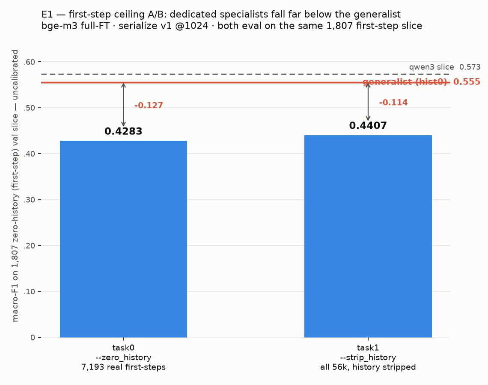

# Branch: first-step — the zero-history failure mode
Git branch: `research/first-step` · Experiments: E1 (ceiling A/B: --zero_history vs --strip_history)
Baseline: hist0 generalist on the 1,807 first-step val slice = 0.555 macro-F1 (qwen3: 0.573).

## Summary (at-a-glance)
Legend: ❌ specializing hurts. Both arms eval on the SAME 1,807 zero-history slice; generalist reference = 0.555 (uncal).

| Exp | Arm | Status | Result (uncal F1) | Δ vs generalist 0.555 | Verdict |
|---|---|:--:|---|---|---|
| E1 | `--zero_history` (7k real first-steps) | ✅ | 0.4283 | −0.127 | ❌ specializing HURTS |
| E1 | `--strip_history` (all 56k, history stripped) | ✅ | 0.4407 | −0.114 | ❌ specializing HURTS |

**Verdict — first-step error is INTRINSIC.** Both specialists land ~0.11 below the generalist on the identical slice → keep the single generalist encoder; **do NOT build a first-step / has-history branch.**

## Prior findings
- step==1 ⟺ len(history)==0 exactly (9,000/70,000; 7,193 train / 1,807 val).
- First-step err ~2× mid-session (36.7% vs ~18%). Both models prior-collapse onto
  list_directory/plan_task; read/grep/glob→list_directory is the dominant confusion.
- Bigger model barely helps (+0.018); per-step recalibration DOESN'T transfer (and
  calibration is banned anyway). Margin separation is narrowest at hist 0
  (correct-median 1.5 vs 3.4 at 10+; wrong flat ~0.5-1.0).
- Figures (legacy location): figures/firststep_*.png, figures/gap_by_histlen.png.

## Results

**2026-07-07 · E1 DONE (A/B)** — bge-m3 full-FT, serialize v1, @1024, epochs 3, lr 2e-5, bs4×ga4.
Both arms evaluate on the SAME 1,807 zero-history (first-step) val slice. Uncalibrated raw-logit
argmax macro-F1 only (calibrated columns 0.494 / 0.5351 ignored per the no-calibration decision).

| arm | training data | val_macro_f1 (uncal) | Δ vs generalist (0.555) | csv |
|-----|---------------|----------------------|-------------------------|-----|
| task0 `--zero_history`  | 7,193 real first-steps          | **0.4283** | −0.127 | `output/pat/ft_results_firststep_0.csv` |
| task1 `--strip_history` | all 56k, history stripped (`turn=` kept) | **0.4407** | −0.114 | `output/pat/ft_results_firststep_1.csv` |

Reference (same 1,807 slice): generalist hist0 bge-m3 = **0.555**; qwen3 = 0.573.

**Verdict — first-step error is INTRINSIC; do NOT build a first-step / has-history branch.**
Both dedicated specialists (0.4283, 0.4407) land **~0.11 below** the generalist's 0.555 on the
identical slice — specializing on first-steps *hurts*. The generalist's edge is its broad,
**history-intact**, all-position training. task1 (strip_history, all 56k) beats task0 (clean 7k
first-step subset) by only +0.0124, so more data helps *somewhat* but even all-56k-stripped stays
far under 0.555 → the gap is not data volume, it's training on history-intact samples. Conclusion:
a dedicated first-step specialist cannot reach the generalist; keep the single generalist encoder
in the submission and do not add a first-step / has-history branch.
