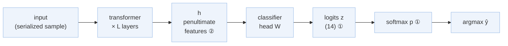
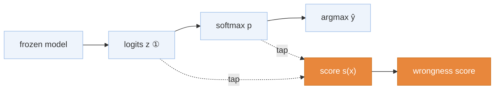
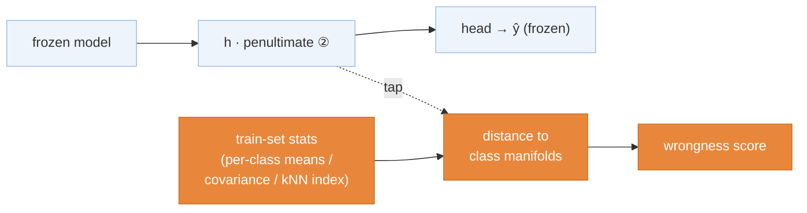
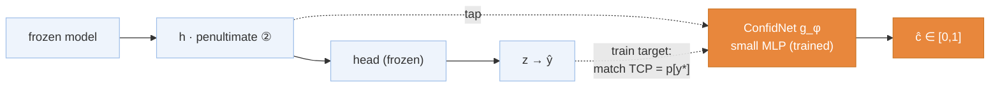
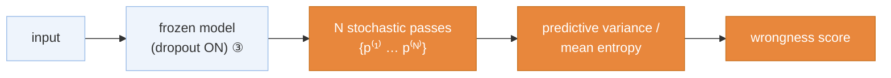
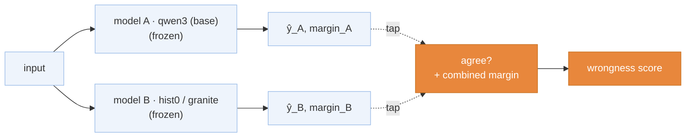

# Branch: misclf-detection — detect when the frozen classifier is wrong

Branch: `research/misclf-detection`. Scope: **misclassification detection** (a.k.a. failure
prediction / error detection). For each input we predict whether the *already-trained, frozen*
champion's argmax is **wrong** — a scalar "wrongness"/confidence score per sample.

**Every detector attaches to the existing model without retraining it.** The classifier's
weights and argmax are untouched; the detector is a read-off (or a small parallel head) hung on
one of three tap points in the frozen forward pass. Downstream use (routing wrong-predicted
samples to a fallback) is a *later* concern — here we only build and rank detectors.

Baseline to beat: single-model margin→correctness **AUROC ≈ 0.83** (measured: qwen3 0.848).

**Base model (the classifier we detect errors on): original `qwen3`** — Qwen3-0.6B full-FT
v1@512 = 0.7682 uncal, the project's canonical champion baseline (logits already cached at
`analysis/cache/qwen3_val_logits.npz`, so M1/M5 run immediately). Re-extract the substrate on the
final model once the loss screen settles.

---

## The frozen model & its tap points

Every method below hooks one of these three points. Blue = the frozen classifier; nothing here
is retrained.

- **① output tap** — the logits `z` / softmax `p` (post-head). Cheapest; already cached.
- **② feature tap** — the penultimate pooled vector `h`.
- **③ stochastic tap** — re-run the encoder with dropout ON (M4 only).

---

## Per-method attachment

Blue = frozen classifier (unchanged) · solid arrows = the frozen forward pass ·
dotted arrows = where the detector taps in · orange = the detector (new).

### M1 · Output-based scores — tap ① (FREE)
A scalar function of the logits/softmax. No forward pass, no training — pure math on cached `z`.

Scores computed on `z`/`p`: **MSP** `max p` · **entropy** `−Σ p log p` · **margin** `z₍₁₎−z₍₂₎` ·
**max-logit** `max z` · **energy** `−log Σ e^z` · **DOCTOR** `Σ p²`.

### M2 · Distance / density — tap ② (needs feature pass)
Score = how far `h` sits from the training class manifolds (stored offline from a train pass).

Variants: **Trust Score** (same- vs other-class NN distance ratio) · **Mahalanobis** (per-class
Gaussian) · **kNN label-agreement**.

### M3 · ConfidNet — tap ②, a parallel trained head
A small MLP `g_φ(h)` runs *alongside* the frozen head, trained (head frozen) to regress the
True-Class-Probability `TCP = p[y*]`. Only `g_φ` learns; the classifier never moves.

Ref: valeoai/ConfidNet — get the official code, diff the TCP target/loss before trusting it.

### M4 · MC-dropout — tap ③ (N× inference, no training)
Turn dropout ON at inference, run the frozen model `N` times, score = disagreement across passes.

### M5 · Cross-model disagreement — two frozen models (FREE)
The base qwen3 + a second independently-trained frozen model; when their argmaxes disagree, the
primary is far likelier wrong. Directly exploits the decorrelated errors behind the 0.810
two-model oracle. Second model = bge-m3 hist0 (cached now → runnable immediately) or granite later.

---

## Summary
Legend: 🟢 ready, not run · ✅ win · ❌ no-go.

| Exp | Detector | Tap | Cost | Needs | Status | AUROC / AURC | Verdict |
|---|---|:--:|:--:|---|:--:|---|---|
| M0 | Substrate extraction (qwen3, base) | — | ~15 min | 1 fwd pass (feats only) | 🟢 | — | logits already cached; only `h` is new |
| M1 | Output scores (MSP/entropy/margin/max-logit/energy/DOCTOR) | ① | free | cached logits | 🟢 | — | baseline battery; reproduce margin ≈ 0.83 |
| M2 | Distance/density (TrustScore/Mahalanobis/kNN) | ② | cheap | M0 feats | 🟢 | — | — |
| M3 | ConfidNet (trained TCP head) | ② | cheap | M0 feats + head | 🟢 | — | ref valeoai/ConfidNet |
| M4 | MC-dropout / TTA variance | ③ | N× infer | dropout fwd | 🟢 | — | optional |
| M5 | Cross-model disagreement (qwen3 vs hist0 / granite) | ①×2 | free | 2 cached logit sets | 🟢 | — | most likely to beat 0.83 (decorrelated errors) |

Recommended order: **M1 + M5 first** (free, straight off cached logits — no M0 needed; bank the
ceiling + cross-model signal), then the **M0 feature pass → M2/M3**.

## M0 — Substrate extraction
- **Model:** original **qwen3** (champion 0.7682, plain CE), frozen. Logits + preds are ALREADY
  cached (`analysis/cache/qwen3_val_logits.npz`; `val_logits.npz` has labels + `va` generator) →
  **M1 and M5 (with cached hist0) are runnable right now, no pass needed.**
- **Only new work:** one inference pass to add the **penultimate embedding `h`** (needed by
  M2/M3), plus the sim/au + first-step masks (reuse `split_indices(42)` + `va`).
- **Output:** `analysis/cache/misclf_substrate_qwen3.npz` — read by M2/M3.
- **Re-run later:** once the loss screen picks the final recipe, re-extract on that model — the
  detector ranking may shift because the loss reshapes confidence.

## Read-outs (every detector reports all)
1. **AUROC(correct vs wrong)** — ranking quality (the headline).
2. **AURC + risk-coverage curve** — competition-relevant (Traub et al., 2024: AUROC alone
   misleads). Figure → `figures/`.
3. **Robustness slices** (MANDATORY — the E6 lesson): au · first-step · sim · later-step. A
   detector that only ranks well on the sim/later majority is a DROP.
4. *(secondary, forward-looking)* downstream macro-F1 if the lowest-score fraction is routed to
   a fallback — honest 2-fold on any threshold.

## Notes / prior evidence
- **E6** ([deferral/results.md](../deferral/results.md)) tried the *routing* half with hand-tuned
  per-class τ + a bge fallback: +0.0047 overall but net-negative on au / first-step → DROP. This
  branch's novelty = *principled/learned* detectors + an honest bake-off; robustness slices carried
  over so we don't repeat the blind spot.
- Ceiling: margin→correctness AUROC ≈ 0.83–0.85; two-model oracle = 0.810 F1.
- Literature (bucket B): MSP (Hendrycks & Gimpel, ICLR'17) · Trust Score (Jiang et al., NeurIPS'18)
  · ConfidNet (Corbière et al., NeurIPS'19) · DOCTOR (Granese et al., NeurIPS'21) · MC-dropout
  (Gal & Ghahramani, ICML'16) · eval flaws (Traub et al., 2024).
